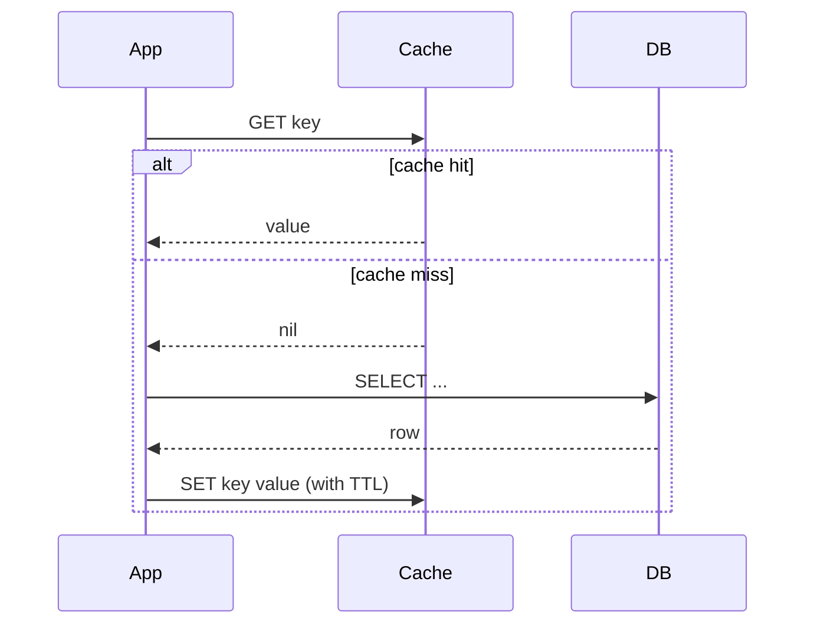
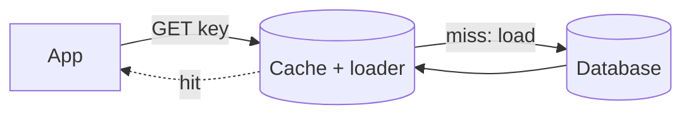
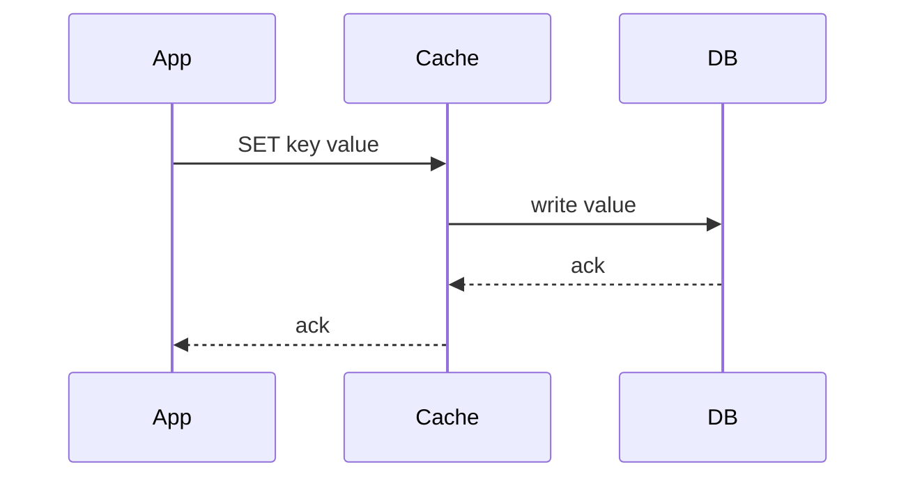
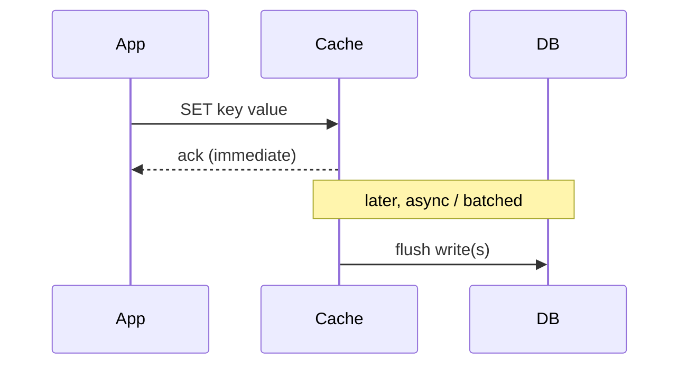

A caching *pattern* answers two questions: **who is responsible for populating the cache** (the application, or the cache layer itself) and **how writes flow** between the cache and the source of truth. Picking a pattern is mostly about how much staleness you can tolerate and how much write latency you're willing to pay.

The patterns split into two groups: **read patterns** (how data gets *into* the cache) and **write patterns** (what happens when data *changes*). Most real systems combine one of each.

## Cache-Aside (Lazy Loading)

The most common pattern, and the default for almost every Redis deployment. The application talks to both the cache and the database directly; the cache itself is "dumb" and just stores what it's told.



The read path is: check the cache; on a hit, return it; on a miss, read the database, **then** write the value back into the cache so the next read is a hit.

```typescript
async function getUser(userId: string): Promise<User> {
  const key = `user:${userId}`;
  const cached = await redis.get(key);
  if (cached !== null) {
    return JSON.parse(cached) as User; // hit
  }

  const user = await db.query('SELECT * FROM users WHERE id = $1', [userId]); // miss
  await redis.set(key, JSON.stringify(user), 'EX', 300); // backfill with a 5-min TTL
  return user;
}
```

- **Strengths**: only requested data is ever cached (no wasted memory on cold keys); the cache can fail and the app still works (it just hits the DB); trivial to reason about.
- **Weaknesses**: every cache miss pays a triple cost (failed lookup + DB read + cache write); the first request for any key is always slow; the app code owns invalidation, which is easy to get wrong.
- **Fits**: read-heavy workloads where the working set is much smaller than the full dataset — the overwhelming majority of web applications.

On writes, cache-aside is usually paired with **invalidation** — when you update the database, you delete the cache key (rather than update it), so the next read lazily reloads the fresh value. Why delete rather than update is covered in [Invalidation and Consistency](/docs/caching/invalidation-and-consistency).

## Read-Through

Read-through moves the miss-handling logic *out* of the application and *into* the cache layer (or a thin library in front of it). The application only ever talks to the cache; the cache knows how to load from the database when it doesn't have the value.



Functionally the read path is identical to cache-aside — the difference is *where the code lives*. With read-through, the loader is configured once and reused everywhere, so every call site behaves consistently.

- **Strengths**: centralizes load logic so it can't drift between call sites; application code is simpler (one `get`, no manual backfill).
- **Weaknesses**: requires a cache layer or library that supports a loader (Redis on its own does not — you build it, or use a client-side library that provides it); same cold-start penalty as cache-aside.
- **Fits**: teams that want a single, enforced read path across many services rather than copy-pasted cache-aside blocks.

## Write-Through

A write pattern: every write goes to the cache **and** the database synchronously, as one logical operation, before the caller gets an acknowledgement.



- **Strengths**: the cache is always consistent with the database for written keys — no stale window on the write path; reads after a write are guaranteed fresh.
- **Weaknesses**: every write pays the latency of *both* stores; you cache data that may never be read again (write amplification); adds little value for write-heavy, read-light data.
- **Fits**: read-heavy data that's also latency-sensitive on reads right after a write (e.g., a user updating their own profile and immediately seeing it). Often combined with read-through so both paths share the cache.

## Write-Behind (Write-Back)

Like write-through, but the database write is **asynchronous**. The application writes to the cache, gets an immediate acknowledgement, and the cache flushes to the database later — batched, coalesced, or on an interval.



- **Strengths**: extremely fast and high-throughput writes (the slow store is off the critical path); multiple writes to the same key can be coalesced into one DB write; absorbs write bursts.
- **Weaknesses**: **risk of data loss** — if the cache node dies before flushing, unpersisted writes are gone; the database is eventually consistent with the cache; far more complex (ordering, retries, conflict handling).
- **Fits**: high-volume, loss-tolerant writes — metrics counters, view counts, activity logs, leaderboards — where losing the last few seconds of writes is acceptable.

## Refresh-Ahead

A predictive read optimization: before a popular key's TTL expires, the cache proactively reloads it from the database in the background, so a hot key never actually goes cold and no user request ever eats the miss penalty.

- **Strengths**: hides the reload latency entirely for hot keys; smooths the load on the database (refreshes are spread out rather than all hitting at expiry).
- **Weaknesses**: refreshes keys that may not be requested again (wasted work); needs accurate prediction of which keys are "hot"; more moving parts.
- **Fits**: a small set of very popular, predictable keys (the homepage feed, a trending list) where the miss penalty would be visible to many users at once.

## Choosing a Pattern

Read and write patterns are picked independently and combined. The table summarizes the trade-offs:

| Pattern        | Type  | Who fills cache | Write latency        | Staleness risk         | Best for                          |
| -------------- | ----- | --------------- | -------------------- | ---------------------- | --------------------------------- |
| Cache-aside    | Read  | Application     | n/a (invalidate)     | Until TTL / invalidate | General-purpose read caching      |
| Read-through   | Read  | Cache layer     | n/a (invalidate)     | Until TTL / invalidate | Centralized, consistent read path |
| Write-through  | Write | Application     | Cache + DB (sync)    | None on written keys   | Read-after-write consistency      |
| Write-behind   | Write | Application     | Cache only (async)   | DB lags cache          | High-volume, loss-tolerant writes |
| Refresh-ahead  | Read  | Cache layer     | n/a                  | Very low for hot keys  | A few predictable hot keys        |

A pragmatic default for most services: **cache-aside reads + invalidate-on-write**, reaching for write-through only where read-after-write freshness matters, and write-behind only for counters and other loss-tolerant, high-write data. Start simple — cache-aside covers the vast majority of cases — and add complexity only when a real latency or consistency requirement forces it.

## Use Cases

Patterns are easier to choose against a concrete scenario than in the abstract. The table maps common, real-world workloads to the pattern that fits best and why.

| Use case                                              | Best pattern                  | Why                                                                                       |
| ----------------------------------------------------- | ----------------------------- | ----------------------------------------------------------------------------------------- |
| Product catalog / article pages (read-heavy, rarely changes) | **Cache-aside + TTL**         | Only requested items get cached; a TTL bounds staleness with zero invalidation effort.    |
| User profile the user just edited (must see own change instantly) | **Write-through**             | Cache and DB update together, so the read right after the write is guaranteed fresh.      |
| View counts, likes, metrics, activity logs (huge write volume, loss-tolerant) | **Write-behind**              | Acknowledge instantly and flush async/batched; losing a few seconds of counts is fine.    |
| Shared session / auth tokens across a fleet           | **Cache-aside on Redis**      | A single distributed store keeps every instance consistent; TTL doubles as session expiry.|
| Homepage feed / trending list (one hot key, many viewers) | **Refresh-ahead**             | Proactively reloads before expiry so no user ever eats the miss; avoids a stampede.       |
| Same read logic reused across many services / call sites | **Read-through**              | Centralizes the load-and-backfill logic so it can't drift between teams.                  |
| Expensive third-party API response (slow, metered, slow-changing) | **Cache-aside + long TTL**    | Each unique call cached once; a long TTL slashes latency and per-call billing.            |
| Config / feature flags read on nearly every request   | **Cache-aside + event-driven invalidation** | Long TTL for hit ratio, but an event invalidates immediately when a flag flips.           |
| Leaderboard / ranking (frequent updates, frequent reads) | **Write-through on a sorted set** | Keep cache and DB in lockstep; Redis sorted sets serve the ranking read directly.          |

If a scenario doesn't match a row cleanly, fall back to the default — **cache-aside reads with invalidate-on-write** — and only specialize once a measured latency or consistency requirement justifies it.
