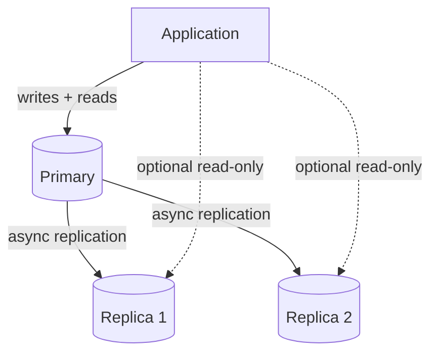
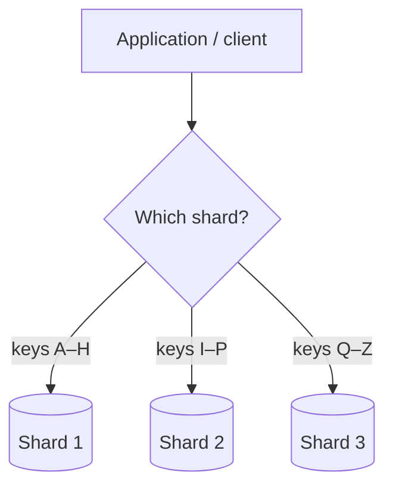
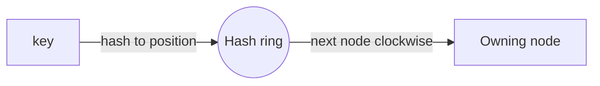
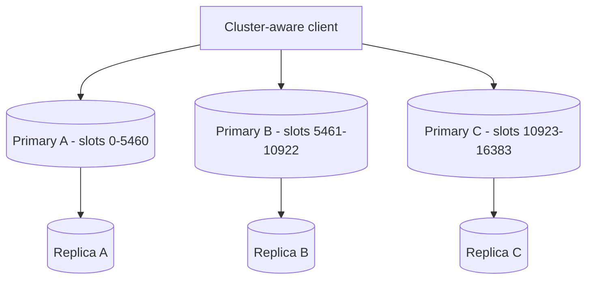

A single Redis node is fast, but it has two hard ceilings: it can only hold as much data as one machine's RAM, and it can only serve as many requests as one machine's CPU and network. The moment your working set or your read throughput outgrows one node, you have to **distribute** the cache. There are two independent axes for doing that — **replication** (copies of the same data) and **sharding** (splitting the data across nodes) — and a production cache usually uses both.

## Replication: Copies for Availability and Reads

Replication keeps one or more **replica** nodes in sync with a **primary**. Writes go to the primary and stream to the replicas; reads can be served by any of them.

Replication buys you two things:

- **High availability** — if the primary dies, a replica can be promoted to take over, so the cache survives a node failure. In Redis this failover is automated by **Redis Sentinel** (or the managed cloud equivalent), which monitors nodes and promotes a replica when the primary stops responding.
- **Read scaling** — read-heavy workloads can fan reads out across replicas, multiplying read throughput without sharding.

The catch is that Redis replication is **asynchronous**: the primary acknowledges a write before the replicas have it. So a read from a replica immediately after a write can return the *old* value — a small but real **staleness window**. For a cache that's usually fine (caches are already an approximation of the truth), but it means you shouldn't route reads to replicas when you need strict read-after-write consistency.

Replication alone does **not** increase capacity — every replica holds a full copy of the same data, so your dataset still has to fit on one node. To grow past that, you shard.

## Sharding: Splitting Data Across Nodes

Sharding (partitioning) splits the keyspace across multiple primary nodes, each owning a slice of the data. This scales both **capacity** (total memory = sum of all shards) and **write throughput** (writes spread across shards).

The core question is **how to map a key to a shard**. The naive answer — `shard = hash(key) % N` — works until `N` changes. The instant you add or remove a node, `N` changes, almost every key maps to a *different* shard, and your cache effectively empties itself in one giant miss storm. That's exactly the kind of event that takes down the database behind the cache.

### Consistent Hashing

**Consistent hashing** solves the reshuffle problem. Instead of mapping keys directly to `N` buckets, you map both nodes and keys onto a circular hash space (a "ring"). Each key is owned by the next node clockwise on the ring.

When a node is added or removed, only the keys in the *arc between that node and its neighbour* move — roughly `1/N` of the keys — instead of nearly all of them. Real implementations add **virtual nodes** (each physical node placed at many points on the ring) so the load spreads evenly and removing a node redistributes its keys across all the others rather than dumping them on one neighbour.

Consistent hashing is the foundation under almost every distributed cache, including Memcached client libraries, DynamoDB, and — in a specialized form — Redis Cluster.

## Redis Cluster

**Redis Cluster** is Redis's built-in sharding and replication, combining both axes into one system. It divides the keyspace into a fixed **16384 hash slots**; each primary owns a range of slots, and each primary can have replicas for failover.

A key's slot is `CRC16(key) % 16384`. The cluster tracks which node owns which slots, and a **cluster-aware client** caches that map so it can talk to the right node directly. If the client asks the wrong node, that node replies with a `MOVED` redirect pointing at the correct one, and the client updates its map. Adding a node is a matter of **migrating slots** to it — only the keys in the moved slots are affected, not the whole keyspace.

Two things to know when using Redis Cluster:

- **Multi-key operations must share a slot.** A command touching several keys (`MGET`, transactions, Lua scripts) only works if all the keys live on the same node. You force this with **hash tags**: the part of the key inside `{}` is what's hashed, so `{user:42}:profile` and `{user:42}:settings` always land on the same slot and can be operated on together.
- **It's still a cache, not a strongly-consistent store.** Replication inside the cluster is asynchronous, so a failover can lose the last few writes that hadn't reached the promoted replica. Acceptable for caching, not for a ledger.

## Where the Sharding Decision Lives

Just like with [load balancing](/docs/load-balancing/client-vs-server), the routing decision can live in different places:

<ul>
  <li><strong>Client-side sharding</strong> — a cluster-aware client library knows the slot map and connects straight to the owning node. Lowest latency (no extra hop), but every client must understand the topology. This is how Redis Cluster clients work.</li>
  <li><strong>Proxy-based sharding</strong> — a proxy (Envoy, Twemproxy, or a managed cluster endpoint) sits in front of the shards and routes for you. Clients stay simple and topology-unaware; the cost is an extra network hop and a component to operate.</li>
  <li><strong>Server-side redirection</strong> — Redis Cluster's own <code>MOVED</code>/<code>ASK</code> mechanism: any node will redirect you to the right one, so even a partially-informed client eventually reaches the correct shard.</li>
</ul>

## Hot Keys and Hot Shards

Sharding spreads load *by key*, which assumes load is roughly even across keys. It often isn't. A single viral item — one product on sale, one celebrity's profile — can concentrate enormous traffic on **one key**, and therefore **one shard**, no matter how many shards you have. Sharding can't help, because the hot key lives on exactly one node.

The standard mitigations:

- **A local (L1) cache in front of the distributed cache** — the hottest keys get served from each app instance's own memory, so the hot shard never even sees most of the traffic. This is the single most effective fix for hot keys.
- **Read replicas for the hot shard** — fan the read traffic for that shard's keys across its replicas.
- **Key splitting** — store `N` copies of the hot value under suffixed keys (`item:99:0` … `item:99:9`) spread across shards, and have clients read a random one. More complex, used only for extreme cases.

## Managed Clustering Offerings

The clouds expose sharded Redis as distinct modes of their managed services:

<Tabs items={['GCP', 'AWS']}>
  <Tab value="GCP">
    - **Memorystore for Redis Cluster** — managed Redis Cluster with automatic sharding across nodes, slot management, and failover handled for you. Use this when one node's memory or throughput isn't enough.
    - **Memorystore for Redis (Standard tier)** — primary + replica with failover, but **not** sharded. Use it for HA and read scaling when your dataset still fits on one node.
  </Tab>
  <Tab value="AWS">
    - **ElastiCache for Redis, cluster mode enabled** — data sharded across multiple node groups (shards), each a primary with replicas. Scales horizontally; you choose the shard count.
    - **ElastiCache for Redis, cluster mode disabled** — a single shard: one primary plus read replicas with Multi-AZ failover. HA and read scaling without sharding.
    - **ElastiCache Serverless** — abstracts shards away entirely and scales capacity automatically.
  </Tab>
</Tabs>

The decision rule is the same on both clouds: reach for **replication (non-sharded)** first — it gives you availability and read scaling with the least complexity — and only move to a **sharded cluster** once a single node genuinely can't hold your working set or absorb your write rate.

## What's Next

Distributing the cache scales it, but it doesn't make the copies any more honest. [Invalidation and Consistency](/docs/caching/invalidation-and-consistency) covers keeping cached data correct, and the failure modes — stampedes, penetration, and avalanches — that a busy distributed cache has to survive.
