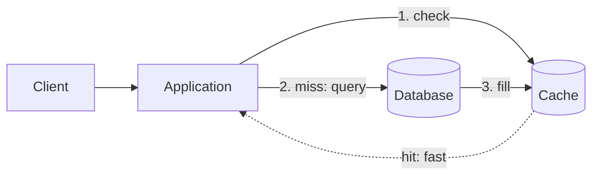
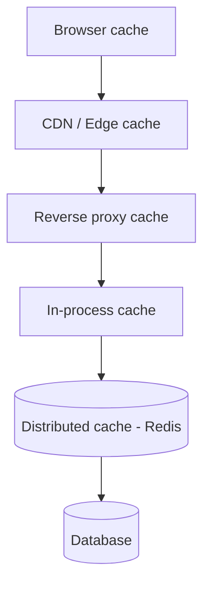

A cache is a fast, temporary store that sits in front of a slower or more expensive source of truth (a database, an external API, an expensive computation) and keeps copies of recently or frequently used data close to where it's needed. The goal is simple: **serve the same answer without paying the full cost to compute it twice.**

The difference is not marginal. A read served from an in-memory cache lands in the **microsecond-to-low-millisecond** range; the same read against a relational database under load is often **tens of milliseconds**, and a call to a third-party API can be **hundreds**. Caching trades a small amount of memory and some consistency risk for large wins in latency, throughput, and cost.

## Why Cache at All

Caching shows up everywhere in scalable systems because it attacks several problems at once:

- **Latency** — memory is orders of magnitude faster than disk or network. The closer the copy, the faster the response.
- **Throughput** — a cache absorbs read traffic that would otherwise hammer the database, letting the same backend serve far more requests per second.
- **Cost** — fewer database queries means smaller (or fewer) database instances, and fewer billed calls to metered external APIs.
- **Resilience** — a cache can keep serving recent data even when the origin is slow or briefly unavailable, smoothing over spikes and partial failures.

The catch is captured by the old joke that there are only two hard things in computer science: **cache invalidation** and naming things. A cache is a _second copy_ of the truth, and the moment the original changes, your copy is wrong. Most of the work in caching is not "how do I store a value" — it's "how do I keep the copy honest, and what do I do when it isn't." That tension runs through every page in this section.

## Where Caches Live

Caching is not a single thing in one place; it's a series of layers, each closer to the user and each catching what the layer behind it would otherwise have to serve.

<ul>
  <li data-mermaid-id="Browser">
    <strong>Browser / client cache</strong> — the client keeps responses locally
    based on HTTP headers (<code>Cache-Control</code>, <code>ETag</code>). The
    cheapest possible cache, because the request never leaves the device.
  </li>
  <li data-mermaid-id="CDN">
    <strong>CDN / edge cache</strong> — geographically distributed nodes cache
    static assets and cacheable responses close to users. Great for images,
    scripts, and public, slow-changing content.
  </li>
  <li data-mermaid-id="LBc">
    <strong>Reverse proxy cache</strong> — Nginx, Varnish, or the LB itself can
    cache full HTTP responses in front of your application tier.
  </li>
  <li data-mermaid-id="Local">
    <strong>In-process (local) cache</strong> — an in-memory map inside the
    application process (Caffeine, Guava, a plain dictionary). Nanosecond
    access, but private to one instance.
  </li>
  <li data-mermaid-id="Dist">
    <strong>Distributed cache</strong> — a shared, networked cache such as{' '}
    <strong>Redis</strong> or Memcached that every application instance reads
    from and writes to. This is the layer this section focuses on.
  </li>
</ul>

Each layer should only need to handle the misses of the layer in front of it. A request that the browser, CDN, and proxy all decline still has two cheap stops — the local cache and the distributed cache — before it's allowed to touch the database.

## Local vs Distributed Caching

The two application-tier caches deserve a direct comparison, because picking the wrong one is a common scaling mistake.

An **in-process cache** lives inside a single application instance. It's blindingly fast and dead simple, but it has two problems the moment you run more than one instance behind a [load balancer](/docs/load-balancing):

- **It doesn't scale with the fleet** — each instance has its own copy, so a 10-instance fleet caches the same hot key 10 times, wasting memory and lowering the effective hit ratio.
- **It drifts** — when the data changes, instance A can invalidate its copy while instances B–J keep serving stale data until their own TTLs expire. Different users get different answers depending on which instance the LB happened to pick.

A **distributed cache** solves both: one logical store, shared by every instance, so the cache is consistent across the fleet and a single entry serves all of them.

| Aspect              | In-process (local) cache      | Distributed cache (Redis)             |
| ------------------- | ----------------------------- | ------------------------------------- |
| Access latency      | Nanoseconds (no network)      | Sub-millisecond (one network hop)     |
| Shared across fleet | No — one copy per instance    | Yes — single logical store            |
| Consistency         | Drifts between instances      | Consistent for all instances          |
| Capacity            | Bounded by one instance's RAM | Scales out across many nodes          |
| Survives restart    | No — lost with the process    | Yes — independent of app lifecycle    |
| Best for            | Tiny, hot, read-mostly data   | Shared state, session data, hot reads |

In practice the strongest setups **combine both**: a small local cache (L1) for the very hottest keys to avoid even the network hop, backed by a distributed cache (L2) as the shared source. The local layer absorbs the worst hot-key traffic; the distributed layer keeps the fleet coherent. The trade-off — local copies can briefly go stale — is covered in [Invalidation and Consistency](/docs/caching/invalidation-and-consistency).

## Measuring a Cache

You can't tune what you don't measure. Three numbers tell you almost everything about a cache's health:

- **Hit ratio** — `hits / (hits + misses)`. The single most important metric. A cache with a 30% hit ratio is barely earning its keep; a well-targeted cache is often 90%+.
  Example:
  Suppose your application receives 1,000 requests:

  Cache hits: 850
  Cache misses: 150
  Hit ratio:

  850 / (850 + 150) = 0.85 = 85%

  This means 85% of requests were served directly from the cache, and only 15% required fetching data from the original source.

  Why it matters

  A higher hit ratio usually means:
  - Faster response times
  - Lower database load
  - Lower infrastructure costs
  - Better scalability

  | Hit Ratio | Interpretation               |
  | --------- | ---------------------------- |
  | 30%       | Cache is not very effective  |
  | 60%       | Moderate                     |
  | 80%       | Good                         |
  | 95%+      | Excellent for many workloads |

- **Latency (p50/p99)** — the whole point is speed. Watch the tail (p99), not just the average — a cache that's fast on average but slow at the tail can still wreck your latency budget.
- **Eviction rate** — how often entries are pushed out to make room. A high eviction rate means the cache is too small for its working set, and your hit ratio will suffer.

A useful rule of thumb: cache the data that is **read far more than it's written** and **expensive to produce**. A user profile read thousands of times between rare edits is an ideal candidate; a value that changes on every read is not worth caching at all.

| Data                             | Changes Often? | Read Often? | Good for Cache? |
| -------------------------------- | -------------- | ----------- | --------------- |
| User profile                     | No             | Yes         | ✅              |
| Product catalog                  | No             | Yes         | ✅              |
| Exchange rates (updated hourly)  | Sometimes      | Yes         | ✅              |
| Live auction highest bid         | Yes            | Yes         | ❌              |
| Current timestamp (`Date.now()`) | Every read     | Yes         | ❌              |

## What's Next

The rest of this section moves from patterns to the concrete machinery of a distributed cache:

- **[Caching Patterns](/docs/caching/caching-patterns)** — cache-aside, read-through, write-through, write-behind, and refresh-ahead: who writes to the cache, when, and what each pattern costs you.
- **[Redis as a Cache](/docs/caching/redis-as-a-cache)** — the data structures, TTLs, eviction policies, and persistence options that make Redis the default distributed cache.
- **[Distributed Caching](/docs/caching/distributed-caching)** — replication, sharding, consistent hashing, and Redis Cluster: how the cache scales past a single node.
- **[Invalidation and Consistency](/docs/caching/invalidation-and-consistency)** — TTL strategies, keeping the copy honest, and surviving stampedes, hot keys, and avalanches.
