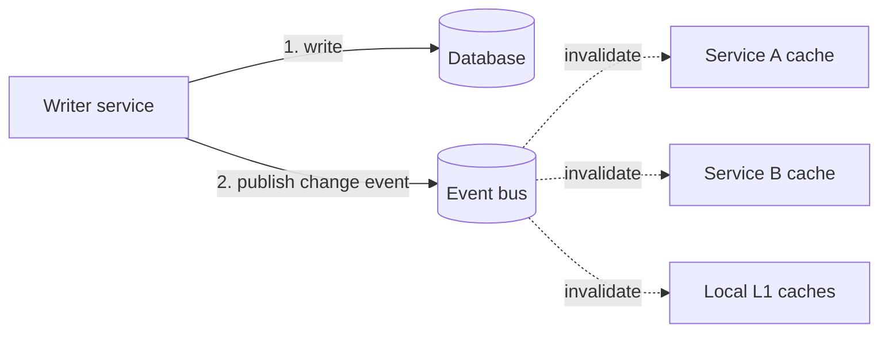
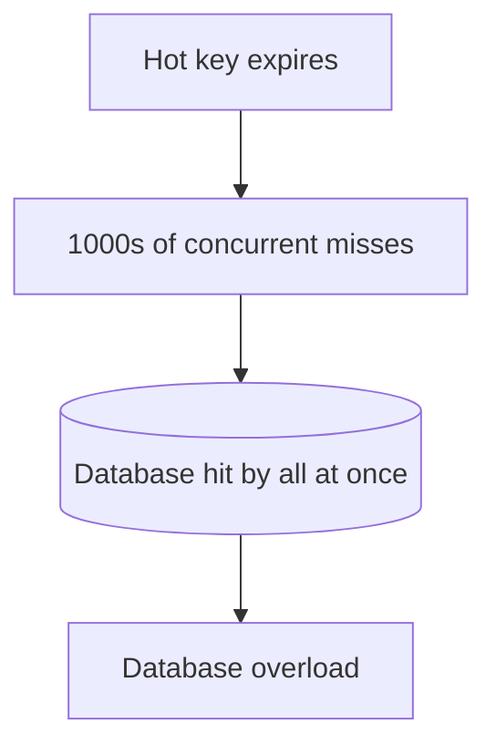

A cache is a second copy of data that lives somewhere else. Everything hard about caching follows from that one fact: the moment the original changes, the copy is wrong, and you have to decide how to find out and what to do about it. This page is about **keeping the copy honest** — and about the failure modes that appear when a busy cache is suddenly wrong, empty, or overwhelmed all at once.

## Invalidation Strategies

There are three ways a cached value stops being served, in increasing order of precision and effort.

### 1. TTL-Based Expiration

The simplest strategy: give every entry a time-to-live and let it expire. You never explicitly invalidate; you just accept that data can be stale for *up to* the TTL.

- **Strengths**: trivial, self-healing, no coordination — even if everything else is broken, staleness is bounded.
- **Weaknesses**: it's a blunt instrument. A short TTL means freshness but a low hit ratio (lots of misses); a long TTL means a high hit ratio but staler data. You're trading freshness against hit rate with a single dial.
- **Fits**: data where "a few minutes old" is fine — product listings, feeds, aggregates, anything not tied to a just-completed user action.

TTL should be the **baseline on every key** regardless of what else you do — it's the safety net that bounds the damage when explicit invalidation has a bug.

### 2. Write-Time Invalidation

When the application writes to the database, it also acts on the cache. The strong recommendation is to **delete (invalidate) the key rather than update it**:

```typescript
async function updateUser(userId: string, changes: Partial<User>): Promise<void> {
  await db.update('users', userId, changes);
  await redis.del(`user:${userId}`); // invalidate, don't rewrite
}
```

Why delete instead of write the new value? Two reasons. First, the next read lazily reloads the *authoritative* value straight from the database, so you can't accidentally cache a value that's inconsistent with what the DB actually stored. Second — and more subtly — **writing the cache on update opens a race**: two concurrent writers can interleave their database write and their cache write such that the cache ends up holding the older of the two values. Deleting sidesteps the race, because a deleted key just forces a fresh read.

### 3. Event-Driven Invalidation

In a system with many services, the service that owns the write often isn't the one that cached the data. Event-driven invalidation publishes a change event (via [asynchronous messaging](/docs/messaging/asynchronous-messaging) — a queue, a stream, or Redis pub/sub) and any service holding a cached copy invalidates its entry when it receives the event.



- **Strengths**: the only practical way to keep **local (L1) caches across a fleet** coherent — the event reaches every instance, not just the one that made the change.
- **Weaknesses**: more infrastructure; invalidation is itself eventually consistent (there's a propagation delay); you have to handle missed or out-of-order events (TTL is the backstop).
- **Fits**: multi-service architectures and any setup with per-instance local caches that would otherwise drift.

## What Consistency You Actually Get

It's worth being honest about the guarantee. A cache is fundamentally an **eventual consistency** tool: between the moment the database changes and the moment the cache reflects it, reads can be stale. The patterns from [Caching Patterns](/docs/caching/caching-patterns) move the staleness window around but rarely eliminate it:

- **Write-through** closes the window for the key you just wrote (cache and DB updated together) — but replicas in a [distributed cache](/docs/caching/distributed-caching) still lag asynchronously.
- **Invalidate-on-write** makes the *next* read fresh, but a read that races *between* the DB write and the cache delete can still repopulate a stale value (the classic cache-aside race).

The practical stance: decide, per piece of data, **how stale is too stale**, set the TTL to bound it, add explicit invalidation where the staleness window matters, and don't pretend a cache gives you strong consistency. If a value genuinely cannot ever be stale, the honest answer is sometimes *don't cache it.*

## Failure Modes of a Busy Cache

Beyond ordinary staleness, three named failure modes show up specifically under load. Each is a different shape of "the cache stops absorbing traffic and the database gets the full firehose."

### Cache Stampede (Thundering Herd)

A popular key expires (or is evicted). Before any single request can recompute it and refill the cache, **thousands of concurrent requests all miss at once**, and all of them hit the database for the same value simultaneously. The database, which was comfortably serving ~0 queries for that key, suddenly gets thousands — and may fall over, taking the whole system with it.



Mitigations, often combined:

- **Locking / request coalescing** — the first request to miss acquires a lock (e.g., `SET lock:key val NX EX 10`) and recomputes the value; everyone else either waits briefly for the result or serves the slightly-stale old value. Only one DB query happens.
- **Early / probabilistic recomputation** — refresh the value *before* it expires, with a small random probability that grows as expiry approaches, so one lucky request rebuilds it while the old value is still being served (the "XFetch" technique). Closely related to [refresh-ahead](/docs/caching/caching-patterns).
- **TTL jitter** — never give a batch of related keys the *same* expiry; add randomness (`TTL ± a few percent`) so they don't all expire on the same second.

### Cache Penetration

Requests for keys that **don't exist anywhere** — a bad ID, a probing attacker, a typo — always miss the cache (nothing to cache) and always fall through to the database. The cache provides zero protection because there's no value to store.

Mitigations:

- **Cache the negative result** — store a short-TTL "not found" sentinel for the missing key, so repeated requests for the same non-existent key are absorbed by the cache instead of the database.
- **Bloom filter** — keep a probabilistic set of keys that *could* exist; if the filter says a key definitely isn't in the dataset, reject it before it ever touches the cache or database.

### Cache Avalanche

A large number of keys expire at the same time — or the cache node itself fails — and the database is hit by the combined miss traffic of *all* of them at once. It's a stampede scaled to the whole keyspace.

Mitigations:

- **TTL jitter across the keyspace** — the same fix as for stampedes, applied broadly: spread expiries over a window so they don't cliff-edge together (common after a bulk warm-up that set every key with an identical TTL).
- **High availability on the cache** — replication and failover (from [Distributed Caching](/docs/caching/distributed-caching)) so a single node dying doesn't dump the entire load on the database.
- **A circuit breaker / rate limit at the database** — when the cache layer is down, shed or throttle load so the database degrades gracefully instead of collapsing.

## Quick Reference

| Problem            | What happens                              | Primary mitigation                          |
| ------------------ | ----------------------------------------- | ------------------------------------------- |
| Stale data         | Cache lags the database                   | TTL + invalidate-on-write                   |
| Local cache drift  | Per-instance copies diverge across fleet  | Event-driven invalidation                   |
| Cache stampede     | Hot key expires, all requests miss at once| Locking / coalescing + TTL jitter           |
| Cache penetration  | Requests for keys that don't exist        | Cache negatives + Bloom filter              |
| Cache avalanche    | Many keys expire (or node dies) together  | TTL jitter + HA + DB circuit breaker        |

The through-line across all of these: a cache is a *probabilistic optimization*, not a contract. Bound the staleness with TTLs, invalidate explicitly where it matters, and design every cache as though it could vanish at any moment — because the system has to survive that cache miss either way.

## Wrapping Up

This section walked from the *why* of caching, through the patterns that fill and update a cache, into Redis as the engine, out to distributing it across nodes, and finally to keeping it correct under load. The recurring lesson is that caching is cheap to add and easy to get subtly wrong: the storage is the easy part, and consistency is the whole job. Start with cache-aside reads, an `allkeys-lru`/`allkeys-lfu` policy, a TTL on every key, and invalidate-on-write — then add replication, sharding, and stampede protection only as real load and real freshness requirements demand them.
