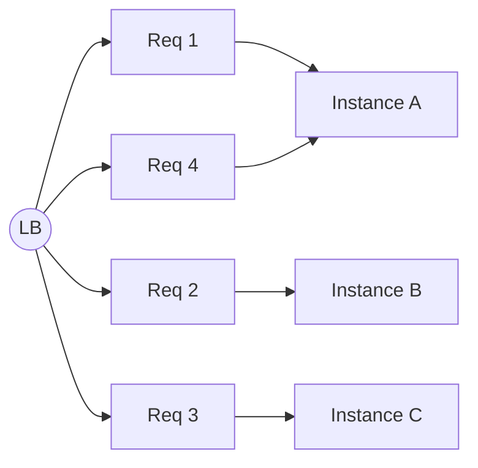
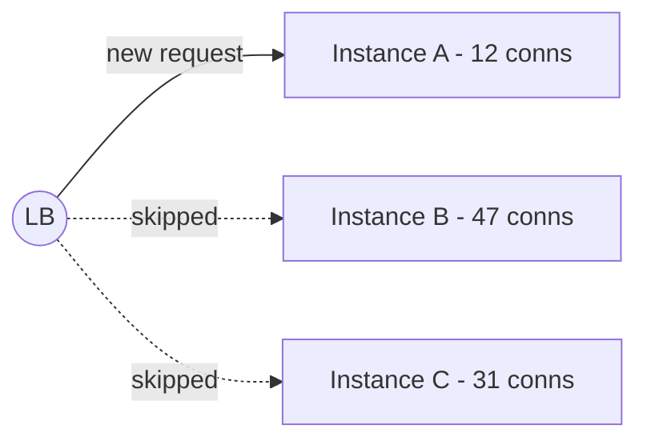
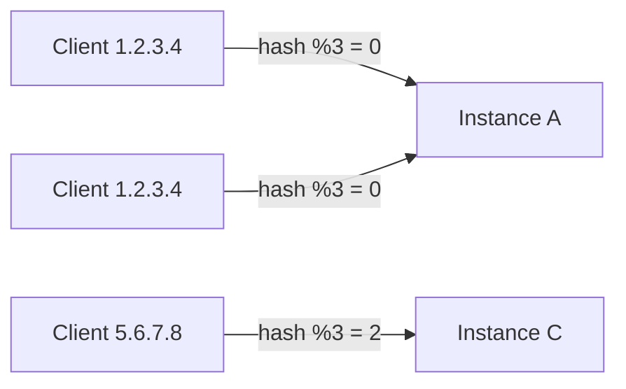

The algorithm a load balancer uses to pick the next backend determines how evenly traffic is spread, how it reacts to slow instances, and whether the same client keeps hitting the same server. Most production systems pick from a small set of well-known strategies.

## Round Robin

The simplest algorithm: requests are handed out to backends in order, cycling through the pool.



- **Strengths**: trivial to reason about, perfectly fair when requests are uniform.
- **Weaknesses**: ignores actual load. If one instance is slow or stuck on a long request, round robin happily keeps sending it more.
- **Fits**: stateless services with very similar request cost (static API, simple CRUD reads).

## Weighted Round Robin

Same as round robin, but each backend has a weight. An instance with weight `3` gets three times as many requests as an instance with weight `1`.

- **Strengths**: lets you mix machine types (e.g., a few large instances and many small ones) or do gradual traffic shifting during a canary rollout.
- **Weaknesses**: still doesn't react to real-time load — just static capacity hints.
- **Fits**: heterogeneous pools, canary deployments, weighted blue/green cutover.

## Least Connections

The LB tracks how many active connections each backend currently has and sends the next request to the one with the fewest.



- **Strengths**: naturally compensates for backends that are slower or hold long-lived connections (WebSockets, gRPC streams, long-polling).
- **Weaknesses**: a backend that opens connections quickly but actually does little work can look "busy" and get starved.
- **Fits**: long-lived connections, mixed request durations, WebSocket fleets.

## Least Response Time / EWMA

A refinement of least-connections that also factors in observed latency: pick the backend with the lowest exponentially-weighted moving average (EWMA) of recent response times, optionally combined with active connection count.

- **Strengths**: routes traffic away from instances that are degrading (GC pauses, noisy neighbours, slow disks) before they fail health checks.
- **Weaknesses**: more state to keep; can oscillate if the signal is too twitchy.
- **Fits**: latency-sensitive APIs where tail latency matters more than throughput.

## IP Hash / Consistent Hashing

The LB hashes a stable client attribute (typically source IP, but it can be a cookie, header, or URL) and uses the hash to pick a backend. The same input always maps to the same backend — until the pool changes.



- **Strengths**: gives free session affinity (no shared session store needed); great for cache locality (the same key lands on the same backend).
- **Weaknesses**: scaling up or down reshuffles assignments unless you use **consistent hashing** with a ring; uneven IP distribution can hot-spot one backend.
- **Fits**: per-user caches, sharded in-memory state, sticky sessions when you can't use cookies.

## Random (with Two Choices)

Pure random is rarely used on its own, but **"power of two choices"** is a surprisingly strong default: pick two backends at random and route to whichever has fewer active connections.

- **Strengths**: almost as good as least-connections in practice, with much lower coordination cost — important in distributed LBs where no single node sees the full picture.
- **Weaknesses**: slightly worse worst-case than full least-connections.
- **Fits**: very large fleets, service-mesh sidecars (Envoy uses this as a default).

## Picking an Algorithm

| Algorithm             | Aware of load? | Aware of latency? | Sticky? | Best for                                |
| --------------------- | -------------- | ----------------- | ------- | --------------------------------------- |
| Round Robin           | No             | No                | No      | Uniform stateless requests              |
| Weighted Round Robin  | No (static)    | No                | No      | Mixed instance sizes, canary shifting   |
| Least Connections     | Yes            | Indirectly        | No      | Long-lived or variable-duration requests |
| Least Response Time   | Yes            | Yes               | No      | Latency-sensitive APIs                  |
| IP Hash / Consistent  | No             | No                | Yes     | Cache locality, session affinity         |
| Two-Random Choices    | Yes            | No                | No      | Very large fleets, mesh sidecars        |

A reasonable default for a public HTTP API is **least-connections at L7**, falling back to round-robin if your LB doesn't expose it. Move to consistent hashing only when you actually have shared state that benefits from locality.

## Configuring the Algorithm

Both major clouds let you pick the algorithm when you create the backend service / target group.

<Tabs items={['GCP', 'AWS']}>
  <Tab value="GCP">
    On a GCP backend service, the algorithm is controlled by `--locality-lb-policy` (for Application LBs) and the load balancing scheme.

    ```bash
    # Create a backend service that uses least-request (power-of-two-choices)
    gcloud compute backend-services create my-app-backend \
      --global \
      --protocol=HTTPS \
      --load-balancing-scheme=EXTERNAL_MANAGED \
      --locality-lb-policy=LEAST_REQUEST \
      --health-checks=my-app-hc

    # Attach the MIG as a backend
    gcloud compute backend-services add-backend my-app-backend \
      --global \
      --instance-group=my-app-mig \
      --instance-group-region=europe-west1 \
      --balancing-mode=UTILIZATION \
      --max-utilization=0.8
    ```

    Common values for `--locality-lb-policy`:

    - `ROUND_ROBIN` — round robin (default)
    - `LEAST_REQUEST` — power-of-two-choices least connections
    - `RING_HASH` — consistent hashing
    - `MAGLEV` — Google's consistent-hash variant, very stable under pool changes
  </Tab>
  <Tab value="AWS">
    On an AWS Application Load Balancer, the algorithm is set per target group via `--load-balancing-algorithm-type`.

    ```bash
    # Create a target group using least outstanding requests
    aws elbv2 create-target-group \
      --name my-app-tg \
      --protocol HTTP \
      --port 8080 \
      --vpc-id vpc-0123456789abcdef0 \
      --target-type instance \
      --health-check-path /healthz

    aws elbv2 modify-target-group-attributes \
      --target-group-arn $TG_ARN \
      --attributes \
        Key=load_balancing.algorithm.type,Value=least_outstanding_requests
    ```

    Supported values on ALB target groups:

    - `round_robin` — round robin (default)
    - `least_outstanding_requests` — least active in-flight requests
    - `weighted_random` — weighted random with optional anomaly mitigation

    Network Load Balancers (L4) use **flow hash** based on the 5-tuple — you cannot change the algorithm, but it gives natural per-connection stickiness.
  </Tab>
</Tabs>

## Common Pitfalls

- **Round robin behind a single TCP keepalive connection** — if a client (or upstream proxy) reuses one TCP connection for many requests against an L4 LB, every request lands on the same backend. Use an L7 LB if you need per-request distribution.
- **Hash-based stickiness during scale events** — naïve `hash % N` reshuffles every key when `N` changes. Use consistent hashing (`RING_HASH`, `MAGLEV`, or AWS's flow-hash on NLB) if stable mapping matters.
- **Mixing weights and autoscaling** — static weights stop reflecting reality once the autoscaler resizes the pool. Prefer a load-aware algorithm and let weights default to equal.
