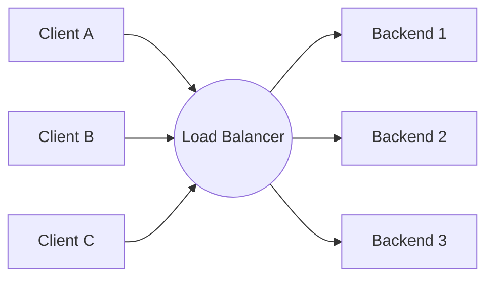
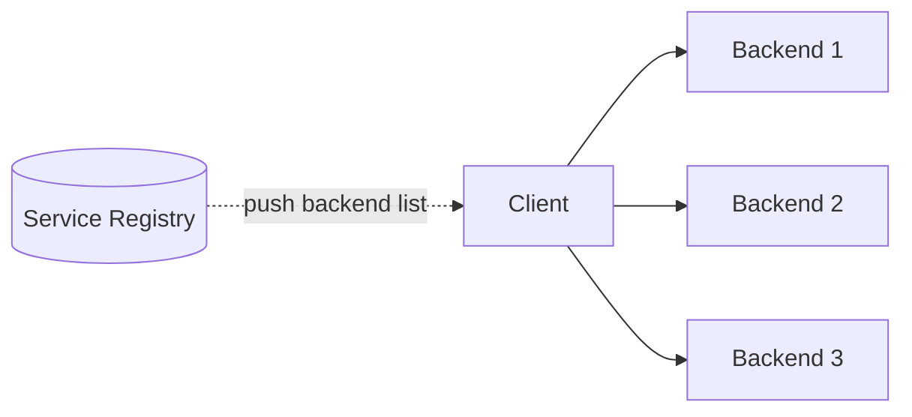
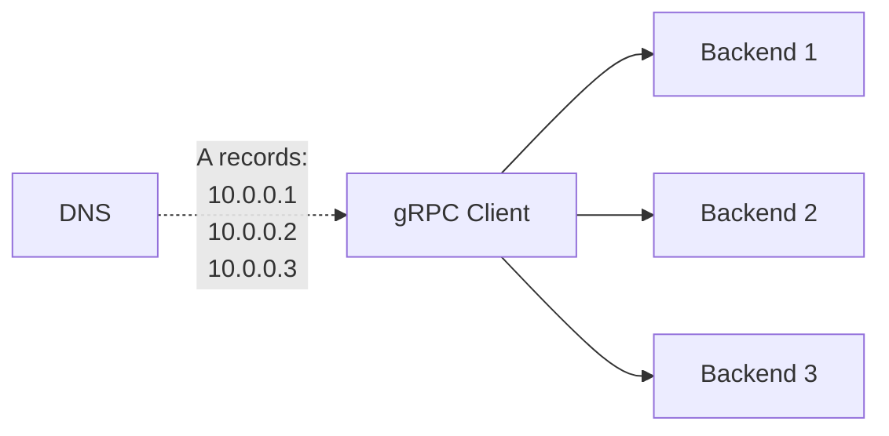
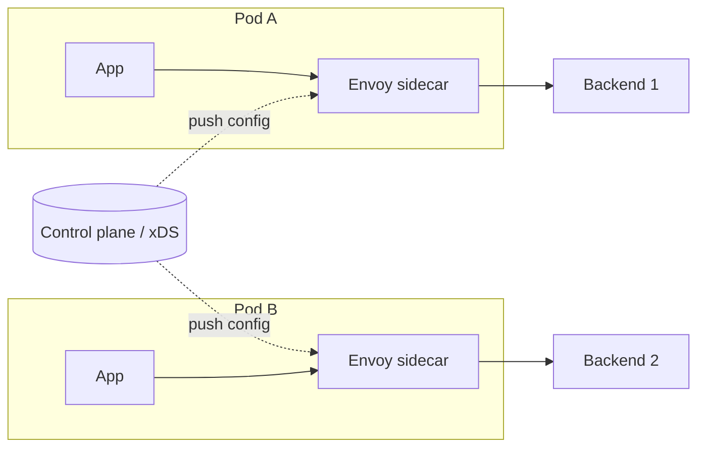

Everything the rest of this section assumed — ALB, NLB, GCP LB, NGINX — is **server-side** load balancing: a dedicated piece of infrastructure between client and backends does the picking, and the client just sends to one address. That's by far the most common shape, but it isn't the only one.

In **client-side** load balancing, the client itself knows about all the healthy backends and decides which one to call — no middleman. This page walks through both, and the three common flavors of client-side LB you'll meet in practice.

## Server-Side Load Balancing

The default. The client sends every request to one address (the LB's IP / DNS name); the LB picks a backend and forwards.

**Strengths:**

- Clients are dumb — they don't need to know the pool, do discovery, or update when backends come and go.
- One central place to configure algorithms, TLS, retries, and rate-limiting.
- Works for any language and any protocol — the client just opens a socket.

**Weaknesses:**

- An extra network hop on every request (client → LB → backend).
- The LB is itself infrastructure: you operate it, scale it, and pay for it.
- The LB can be a single point of failure (mitigated with HA pairs, anycast, etc.).

**Best for:** edge traffic where the client is outside your control (browsers, mobile apps, third-party APIs), and for any non-HTTP TCP/UDP traffic.

## Client-Side Load Balancing

The client holds a list of healthy backends — populated from a **service registry** — and picks one itself for each call. There's no dedicated LB in the path.

**Strengths:**

- One fewer network hop — client talks straight to the backend.
- No central LB infrastructure to operate or pay for.
- The client knows its own state (which calls just timed out, which backend is slow) and can use that to pick smarter.
- Naturally scales — there's no shared LB to bottleneck on.

**Weaknesses:**

- Every client needs LB logic — either built-in to your runtime (gRPC), pulled in as a library, or run as a sidecar.
- You need a **service registry** to be the source of truth (Consul, Eureka, the Kubernetes API, xDS).
- Behavior is distributed across N clients — harder to debug, harder to enforce policy uniformly.
- Only practical when **you control the client** (your own backend services). Useless for browser traffic.

**Best for:** internal service-to-service traffic in your own datacenter, especially gRPC and other long-lived-connection protocols.

## Three Flavors of Client-Side LB

Client-side LB shows up in three common shapes. The difference is mostly *where the logic lives*.

### 1. DNS / Headless Services

The simplest form. Clients resolve a hostname and get back a *list* of backend IPs; the client library picks one (usually round-robin).

- **Kubernetes** offers this via **headless services** (`clusterIP: None`) — DNS returns one A record per pod.
- **gRPC** has built-in DNS resolution and round-robin picking — `grpc://service.namespace.svc.cluster.local`.
- **SRV records** add port and priority info on top.

✅ Almost zero extra infrastructure. 
❌ DNS caching means clients can hold a stale list (TTL trade-off). 
❌ Health awareness is indirect — the DNS server only knows what its source (k8s, Consul) tells it.

### 2. In-Process Library

A library inside the client app talks to a service registry, subscribes to changes, and picks backends. All the LB logic runs in the client's own process.

- **gRPC** with **xDS** — gRPC apps can be xDS clients without a sidecar.
- **Spring Cloud LoadBalancer** (JVM ecosystem).
- **Netflix Ribbon** (legacy, but still common in older Java stacks).
- **Consul** SDK with HashiCorp's blocking-query pattern.

✅ Direct connection, full feature set — retries, circuit breakers, latency-aware picks. 
❌ You link the library in every language and runtime you use — polyglot fleets get expensive. 
❌ Policy updates ship in app releases — slow to roll out new LB behavior.

### 3. Sidecar / Service Mesh

A separate proxy process runs next to the app, typically in the same Kubernetes pod. The app talks to localhost; the sidecar does discovery, picking, and forwarding.

- **Envoy** in **Istio**, **Linkerd**, **Consul Connect**.
- **AWS App Mesh**, **GCP Anthos Service Mesh** — managed mesh products.

✅ Language-agnostic — the same sidecar works for Java, Go, Python, Rust apps. 
✅ Central control plane lets you push new policy without redeploying apps. 
✅ You get advanced features for free: mTLS, retries, outlier detection, traffic shifting. 
❌ A new process per workload — extra memory, CPU, and one more thing that can break. 
❌ Mesh operational complexity is real (control plane, certs, debugging the extra hop).

## Comparison

| Aspect            | Server-side          | DNS-based         | In-process lib       | Sidecar mesh         |
| ----------------- | -------------------- | ----------------- | -------------------- | -------------------- |
| Extra network hop | Yes                  | No                | No                   | Localhost only       |
| Language coupling | None                 | None              | One lib per language | None                 |
| Health awareness  | Active LB probes     | Indirect via DNS  | Direct from registry | Direct + probes      |
| Advanced features | What the LB supports | Minimal           | Library-dependent    | Full (mTLS, retries) |
| Operational cost  | LB infrastructure    | DNS / registry    | Library upgrades     | Sidecar + control plane |
| Typical fit       | Edge / public        | Simple internal gRPC | One-language fleet | Polyglot microservices |

## Picking One

A useful default:

- **Edge traffic from clients you don't control** (browsers, mobile, third parties) → **server-side L7** (ALB, GCP LB, NGINX).
- **Stateful TCP from internal services** (databases, brokers) → **server-side L4** (NLB, Internal Network LB).
- **Internal HTTP/gRPC between your own services:**
  - Small fleet, one language → **DNS-based client-side LB** (cheapest, almost free).
  - Polyglot fleet, want central policy → **sidecar / service mesh**.
  - Single-language fleet with rich LB needs → **in-process library**.

Most real systems run **both**: server-side at the edge for everything coming in from the outside, and client-side (often via a mesh) between internal services.

## Common Pitfalls

- **DNS TTL gotchas** — DNS-based client-side LB only refreshes the backend list when the cache expires. Set TTLs aggressively low, or use a library that re-resolves on connection errors.
- **Stale registry data** — client-side LB is only as fresh as the registry. If discovery is slow to mark a dead instance, every client keeps trying it. Active health checks on the client (or short registry TTLs) help.
- **No connection re-balancing** — long-lived connections (gRPC, WebSocket) don't naturally re-balance when new backends appear. Use periodic reconnect or a `max connection age` setting to force rotation.
- **Mesh sidecar over-reach** — not every team needs a service mesh. The operational cost is real; only adopt one when you actually need its features (mTLS, traffic shifting, mesh-wide observability) across many services.
