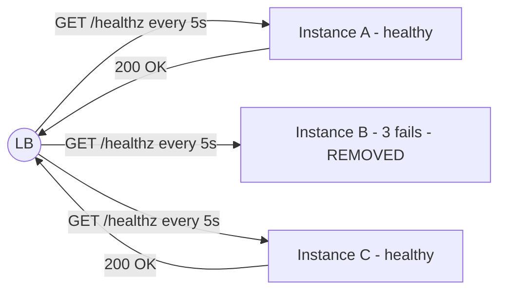
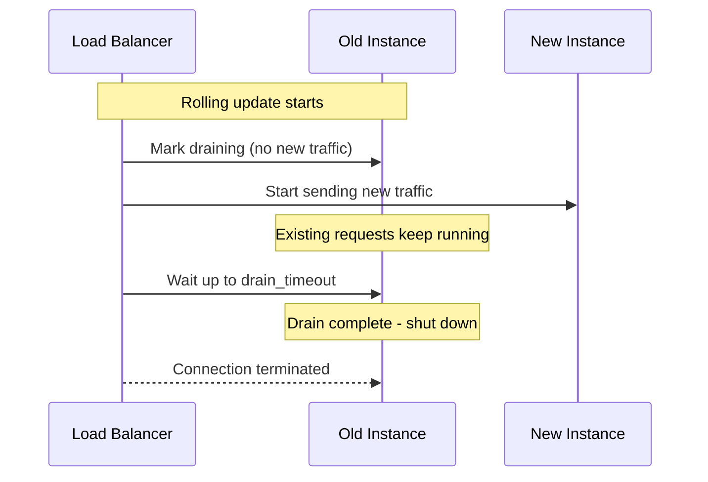
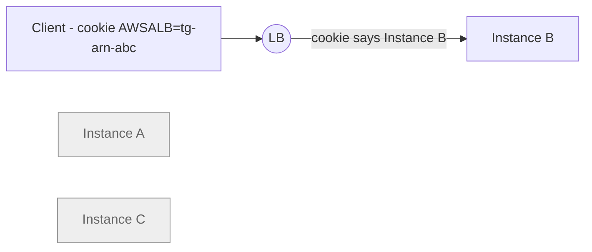
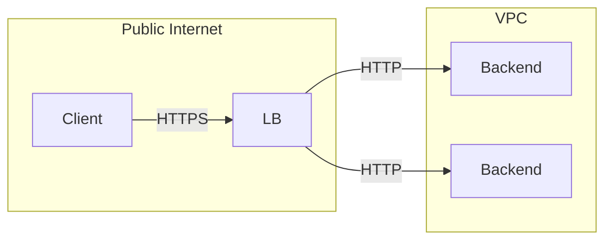

Picking the right algorithm only matters if the load balancer is actually routing to **healthy** instances. The rest of the LB's job is keeping the pool clean: removing sick backends, draining traffic during deployments, optionally pinning sessions, and terminating TLS at the edge.

## Health Checks

A health check is a probe the LB runs against each backend on an interval. If enough consecutive probes fail, the backend is marked unhealthy and removed from the rotation; once it passes again it comes back.



### Active vs Passive Checks

- **Active health checks** — the LB sends a probe on its own schedule, regardless of real traffic. This is what most cloud LBs do by default. Easy to reason about, but the LB can take up to `interval * threshold` seconds to notice an instance has died.
- **Passive health checks** (also called **outlier detection**) — the LB watches real responses and ejects a backend after some number of `5xx`s or connection failures in a window. Reacts much faster, but only fires when there's traffic to observe.

The strongest setups use **both**: active probes to set the steady-state membership of the pool, plus outlier detection to evict a backend the moment real traffic starts failing.

### Designing the Health Check Endpoint

A health check is only as good as what it actually verifies. Two extremes to avoid:

- **Too shallow**: returning `200 OK` from `/healthz` without checking anything. The process is up, but it can't reach the database — and the LB keeps sending traffic.
- **Too deep**: checking every downstream (DB, cache, message broker, third-party APIs) on every probe. One blip in a non-critical dependency takes the whole fleet out of rotation.

A good pattern is a **two-tier** health endpoint:

- `/healthz` (liveness) — is the process up and able to respond? Used by the orchestrator (e.g., Kubernetes) to decide whether to restart the container.
- `/readyz` (readiness) — can this instance actually serve traffic right now? Checks the things it *must* have to serve a request (DB connection pool, warmed caches). Used by the **load balancer** to decide whether to send traffic.

### Configuring Health Checks

<Tabs items={['GCP', 'AWS']}>
  <Tab value="GCP">
    Health checks on GCP are a first-class resource, separate from the LB itself, so they can be reused across backend services.

    ```bash
    # Create an HTTP health check pointing at /readyz
    gcloud compute health-checks create http my-app-hc \
      --port=8080 \
      --request-path=/readyz \
      --check-interval=5s \
      --timeout=3s \
      --healthy-threshold=2 \
      --unhealthy-threshold=3

    # Attach it to the backend service
    gcloud compute backend-services update my-app-backend \
      --global \
      --health-checks=my-app-hc
    ```

    For outlier detection (passive checks), set it on the backend service:

    ```bash
    gcloud compute backend-services update my-app-backend \
      --global \
      --outlier-detection-consecutive-errors=5 \
      --outlier-detection-interval=10s \
      --outlier-detection-base-ejection-time=30s
    ```
  </Tab>
  <Tab value="AWS">
    On AWS, health-check parameters live on the target group itself.

    ```bash
    aws elbv2 modify-target-group \
      --target-group-arn $TG_ARN \
      --health-check-protocol HTTP \
      --health-check-path /readyz \
      --health-check-port 8080 \
      --health-check-interval-seconds 5 \
      --health-check-timeout-seconds 3 \
      --healthy-threshold-count 2 \
      --unhealthy-threshold-count 3 \
      --matcher HttpCode=200
    ```

    AWS doesn't expose passive outlier detection on ALB/NLB directly — for that level of control you typically run a service mesh (App Mesh, Envoy-based) in front of the targets.
  </Tab>
</Tabs>

## Connection Draining

When you remove an instance from the pool — during a rolling deployment, a scale-down, or a manual replacement — there are almost always in-flight requests still being served by that instance. Connection draining tells the LB:

> "Stop sending new requests to this instance, but let the existing ones finish for up to N seconds before you kill it."



This is what makes [zero-downtime deployments](/docs/scalable-deployment) actually zero-downtime: the rolling update would otherwise rip the rug out from under whichever clients had open requests against the old VM.

<Tabs items={['GCP', 'AWS']}>
  <Tab value="GCP">
    Draining is configured on the backend service. The MIG calls this "connection draining timeout".

    ```bash
    gcloud compute backend-services update my-app-backend \
      --global \
      --connection-draining-timeout=60
    ```

    Combine with the MIG's update policy so the autoscaler waits for draining before deleting the VM:

    ```bash
    gcloud compute instance-groups managed rolling-action start-update my-app-mig \
      --version template=my-app-template-1.4.0 \
      --max-unavailable=1 \
      --max-surge=1 \
      --min-ready=30s
    ```
  </Tab>
  <Tab value="AWS">
    On AWS this is called **deregistration delay** and is set per target group.

    ```bash
    aws elbv2 modify-target-group-attributes \
      --target-group-arn $TG_ARN \
      --attributes \
        Key=deregistration_delay.timeout_seconds,Value=60
    ```

    The default of 300 seconds is often too long for short-request HTTP services — every rolling deployment then takes minutes longer than it needs to. Tune it to slightly longer than your p99 request duration.
  </Tab>
</Tabs>

## Sticky Sessions

Sometimes you actually *want* the same client to keep hitting the same backend — usually because that backend holds in-memory state (a WebSocket session, a server-side shopping cart, an upload-in-progress). The LB can enforce this with **session affinity**, also called **sticky sessions**.

Two common mechanisms:

- **Cookie-based** (L7 only): the LB injects its own cookie (`GCLB`, `AWSALB`, …) that pins the client to a specific backend.
- **Source-IP-based** (L4 or L7): the LB hashes the client IP and always sends it to the same backend. Cheap, but breaks when clients sit behind NAT or change IPs (mobile networks).



**Stickiness is a trade-off**, not a default to turn on:

- It defeats load-balancing fairness — a small set of "whale" clients can hot-spot one backend.
- It makes rolling deployments harder, because draining one instance disconnects every session pinned to it.
- It hides scale-out problems — adding more instances doesn't help the overloaded one.

The cleanest long-term answer is usually to **externalise the state** (Redis, a session store, a database) and keep the backends stateless, so the LB is free to use a load-aware algorithm. Reach for stickiness only when externalising isn't practical (WebSockets, in-flight uploads, etc.).

<Tabs items={['GCP', 'AWS']}>
  <Tab value="GCP">
    ```bash
    # Cookie-based affinity (L7 only)
    gcloud compute backend-services update my-app-backend \
      --global \
      --session-affinity=GENERATED_COOKIE \
      --affinity-cookie-ttl=3600

    # Client-IP affinity (works on L4 and L7)
    gcloud compute backend-services update my-app-backend \
      --global \
      --session-affinity=CLIENT_IP
    ```
  </Tab>
  <Tab value="AWS">
    ```bash
    # ALB: cookie-based stickiness (1 hour)
    aws elbv2 modify-target-group-attributes \
      --target-group-arn $TG_ARN \
      --attributes \
        Key=stickiness.enabled,Value=true \
        Key=stickiness.type,Value=lb_cookie \
        Key=stickiness.lb_cookie.duration_seconds,Value=3600

    # NLB: source-IP affinity
    aws elbv2 modify-target-group-attributes \
      --target-group-arn $NLB_TG_ARN \
      --attributes \
        Key=stickiness.enabled,Value=true \
        Key=stickiness.type,Value=source_ip
    ```
  </Tab>
</Tabs>

## TLS Termination

You generally don't want every backend instance to manage its own TLS certificates — rotating them across an autoscaling fleet is painful, and the cryptographic overhead adds up. The load balancer is the natural place to terminate TLS.

Three common modes:

- **TLS termination at the LB** — the LB holds the public certificate, decrypts the request, and forwards plain HTTP (or fresh HTTP/HTTPS) to the backends inside the VPC. Simplest and most common.
- **End-to-end TLS (re-encrypt)** — the LB terminates the public TLS, then opens a *new* TLS connection to the backend. Used when traffic between the LB and backends must also be encrypted (regulated environments).
- **Pass-through (TLS SNI routing)** — the LB never decrypts; it routes based on the TLS SNI hostname and forwards raw bytes. The backends own the cert. This is L4 territory.



<Tabs items={['GCP', 'AWS']}>
  <Tab value="GCP">
    Use **managed certificates** so the LB renews them for you — no manual rotation in your CI.

    ```bash
    # Create a Google-managed certificate
    gcloud compute ssl-certificates create my-app-cert \
      --domains=api.example.com \
      --global

    # Attach it to the target HTTPS proxy in front of the LB
    gcloud compute target-https-proxies update my-app-https-proxy \
      --ssl-certificates=my-app-cert \
      --global
    ```

    For backend re-encryption, configure the backend service protocol as `HTTPS` and attach a backend-side certificate.
  </Tab>
  <Tab value="AWS">
    ACM (AWS Certificate Manager) provides free, auto-renewed certificates that integrate directly with ALB/NLB listeners.

    ```bash
    # Request a public certificate (DNS validation)
    aws acm request-certificate \
      --domain-name api.example.com \
      --validation-method DNS

    # Attach it to an HTTPS listener on the ALB
    aws elbv2 create-listener \
      --load-balancer-arn $ALB_ARN \
      --protocol HTTPS \
      --port 443 \
      --certificates CertificateArn=$CERT_ARN \
      --ssl-policy ELBSecurityPolicy-TLS13-1-2-2021-06 \
      --default-actions Type=forward,TargetGroupArn=$TG_ARN
    ```

    Pick a modern `--ssl-policy` (TLS 1.2+) to avoid keeping outdated ciphers enabled.
  </Tab>
</Tabs>

## Summary

A healthy load-balancer setup combines four things:

1. **Health checks** — active probes against `/readyz`, ideally backed up by passive outlier detection.
2. **Connection draining** — tuned to your p99 request duration so rolling deployments don't drop in-flight work.
3. **Stickiness only when state forces it** — and when you reach for it, prefer cookie-based over IP-based.
4. **TLS at the edge** — managed certs, modern cipher policy, plain HTTP behind the LB unless compliance requires re-encryption.

Together with the [algorithm choice](/docs/load-balancing/algorithms), these are the levers you actually tune in production to keep latency low and availability high.
