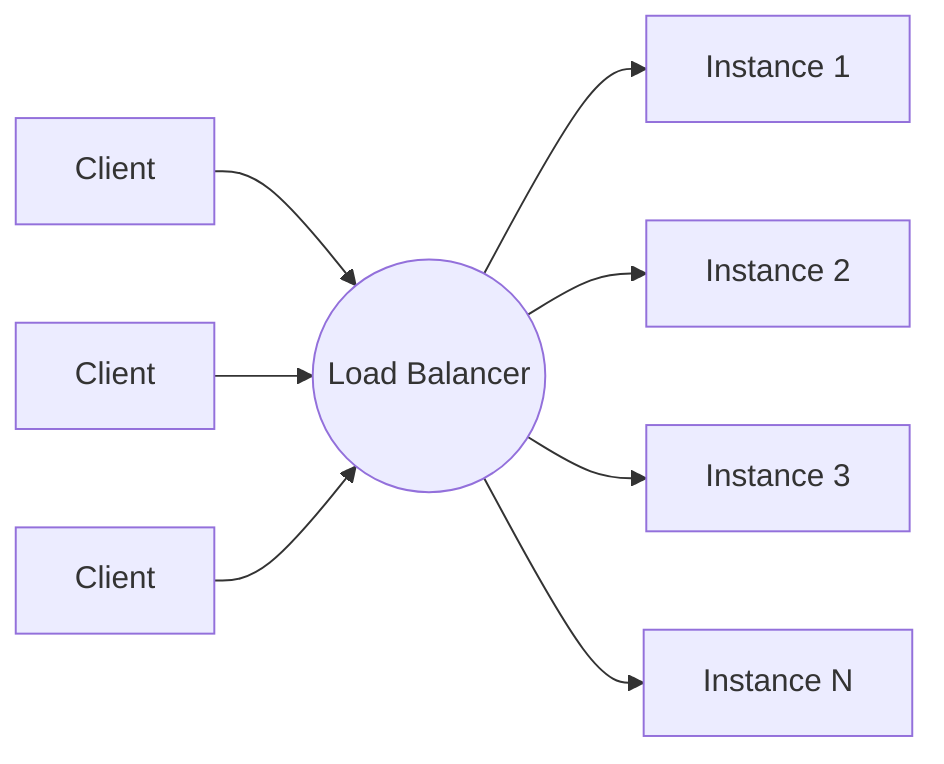
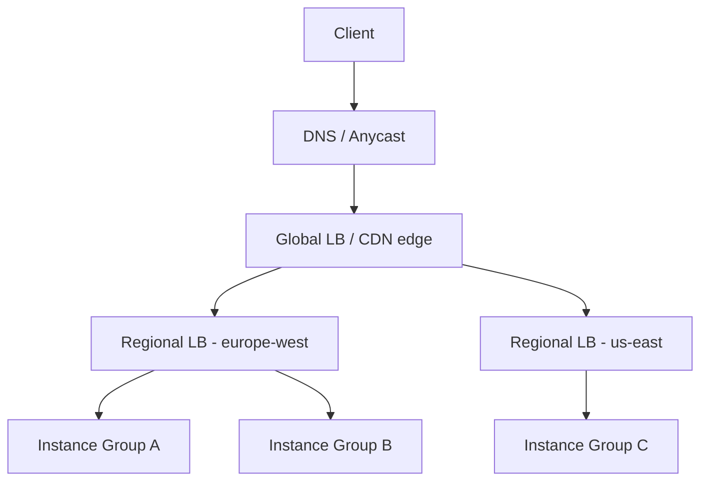
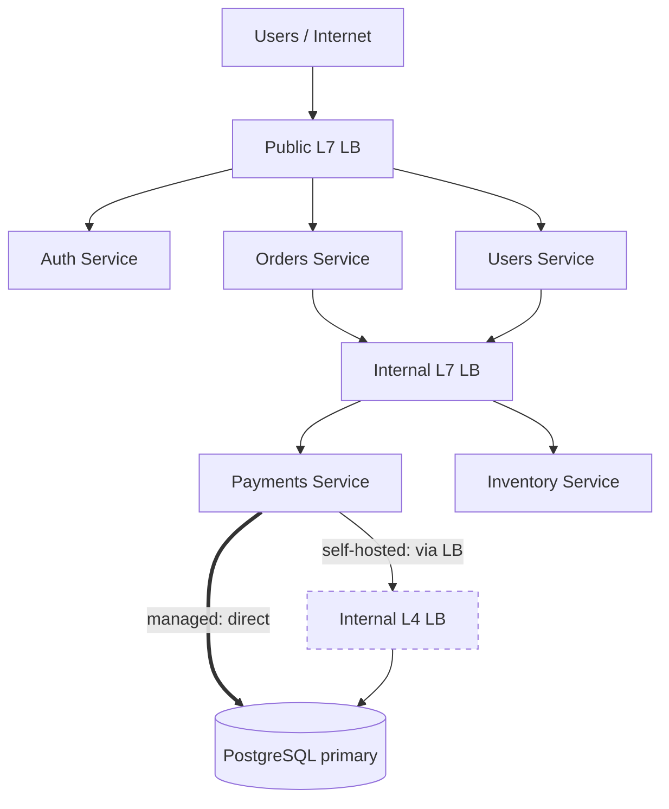
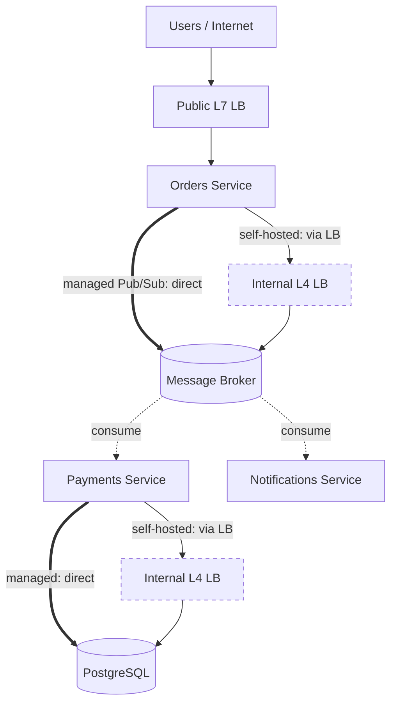

A load balancer (LB) sits in front of a pool of backend instances and decides which instance handles each incoming request. It is the component that turns a fleet of identical servers (like the [Managed Instance Group](/docs/scalable-deployment) we deployed earlier) into a single, scalable, highly available service from the client's point of view.

## Overview

A load balancer's job goes well beyond "pick a server". In a production topology it is typically responsible for:

- **Traffic distribution** — spreading requests across healthy instances using a chosen algorithm
- **Health awareness** — detecting unhealthy instances and removing them from the pool
- **TLS / SSL termination** — decrypting HTTPS at the edge so backends can serve plain HTTP internally
- **Scalability glue** — letting autoscalers add or remove instances without clients noticing
- **Failover** — routing around failed zones or regions
- **Connection management** — keepalive, draining, rate limiting, and (sometimes) request buffering

The choices you make about a load balancer — what layer it operates at, what algorithm it uses, how it checks health — directly shape the latency, availability, and fairness of your system.

## Layer 4 vs Layer 7

Load balancers are most commonly grouped by the OSI layer they understand.

#### Layer 4 (Transport)

An L4 load balancer routes based on TCP/UDP information: source IP, destination IP, ports. It does not look inside the packet payload, so it cannot make decisions based on HTTP paths, headers, or cookies.

- Very fast, low CPU overhead
- Works for any TCP/UDP protocol (databases, gRPC streams, game servers, MQTT, etc.)
- Cannot do path-based routing, content-based routing, or HTTP-level retries

#### Layer 7 (Application)

An L7 load balancer terminates the connection, parses the HTTP request, and can route based on URL path, host header, cookies, method, or any other application-level signal.

- Path-based and host-based routing (`/api/*` to one pool, `/static/*` to another)
- HTTP-aware features: retries on `5xx`, header rewriting, request/response transformations
- Native TLS termination and HTTP/2, HTTP/3 support
- Higher CPU cost per request than L4

#### Comparison

| Aspect              | Layer 4 (Transport)              | Layer 7 (Application)               |
| ------------------- | -------------------------------- | ----------------------------------- |
| Inspects payload?   | No                               | Yes (HTTP-aware)                    |
| Protocols           | Any TCP/UDP                      | HTTP, HTTPS, HTTP/2, gRPC, WebSocket |
| Routing decisions   | IP + port                        | Path, host, header, cookie, method  |
| TLS termination     | Pass-through (usually)           | Native                              |
| Latency overhead    | Very low                         | Higher                              |
| Typical use         | Databases, game servers, raw TCP | Public web APIs, microservice mesh  |

A common production pattern is to put an L7 load balancer at the edge for HTTP traffic and an L4 load balancer in front of internal non-HTTP services.

## Where Load Balancers Live

Most cloud deployments combine multiple load-balancing tiers:

<ul>
  <li data-mermaid-id="DNS"><strong>DNS / Anycast</strong>: how the client first finds the load balancer. DNS turns your domain (e.g., <code>api.example.com</code>) into an IP address; <strong>anycast</strong> lets that same IP be announced from many locations worldwide at once, so the internet's routing automatically sends each user to the nearest one. It's the trick that makes a single &quot;global IP&quot; actually behave globally.</li>
  <li data-mermaid-id="Global"><strong>Global load balancer</strong>: you publish a single IP address (or domain) to the world, but behind the scenes the LB sends each user to the <strong>closest healthy region</strong>. A user in Paris hits your <code>europe-west</code> servers; a user in Tokyo hits your <code>asia-east</code> servers — automatically, with no DNS tricks on your side. If one region goes down, traffic shifts to another region without users noticing.</li>
  <li data-mermaid-id="Regional1 Regional2"><strong>Regional load balancer</strong>: distributes traffic across zones inside one region — usually in front of an autoscaling group like a MIG/ASG.</li>
  <li><strong>Internal load balancer</strong>: same idea, but only reachable from inside your VPC — used between microservices.</li>
</ul>

## Cloud Offerings at a Glance

The cloud providers expose these as distinct products. The names matter when you start configuring them.

<Tabs items={['GCP', 'AWS']}>
  <Tab value="GCP">
    - **Global External Application LB** — L7, public, multi-region. 
      *Example:* a SaaS dashboard at `app.example.com` used by customers in the US, EU, and Asia — one IP, traffic auto-routed to the nearest region.
    - **Regional External Application LB** — L7, public, single region. 
      *Example:* a Polish-only e-commerce site — all customers are in the EU, so paying for global reach makes no sense.
    - **External Network LB** — L4, public, raw TCP/UDP. 
      *Example:* a multiplayer game server that takes UDP packets from players, or an MQTT broker for IoT devices.
    - **Internal Application LB** — L7, VPC-only. 
      *Example:* your `users-service` (HTTP/gRPC) called by `orders-service` and `payments-service` inside the VPC.
    - **Internal Network LB** — L4, VPC-only. 
      *Example:* a PostgreSQL primary that internal services connect to over TCP 5432, or an internal Redis cluster.
  </Tab>
  <Tab value="AWS">
    - **Application Load Balancer (ALB)** — L7, public/internal, regional. 
      *Example:* `api.example.com` where `/auth/*` routes to the auth service and `/orders/*` routes to the orders service.
    - **Network Load Balancer (NLB)** — L4, regional, very high throughput, static IP. 
      *Example:* a Kafka cluster exposed over TLS pass-through, or a game backend that needs a stable IP for player firewall rules.
    - **Gateway Load Balancer (GWLB)** — L3, transparent appliance insertion. 
      *Example:* routing all VPC egress traffic through a Palo Alto firewall before it reaches the internet.
    - **Global Accelerator** — anycast layer in front of ALBs/NLBs. 
      *Example:* a real-time multiplayer game with clusters in three regions — players worldwide connect to a single IP and get routed to the nearest cluster.
  </Tab>
</Tabs>

## Putting It Together: A Microservice API

Imagine a typical microservice backend behind `api.example.com`:

- A **public HTTP(S) entry point** that terminates TLS and routes by path (`/auth/*`, `/orders/*`, `/users/*`) to the right service.
- A handful of **stateless microservices** (auth, users, orders, payments, inventory) that call each other over HTTP/gRPC.
- A **stateful tier** behind the services — PostgreSQL primary, Redis, maybe Kafka — reachable only over raw TCP.

You need **three different load balancers** in this topology, each doing a different job:

<ul>
  <li data-mermaid-id="PublicLB"><strong>Public L7 LB</strong> — terminates TLS, routes by URL path/host, serves the public API.</li>
  <li data-mermaid-id="InternalLB"><strong>Internal L7 LB</strong> — sits between microservices inside the VPC; HTTP/gRPC aware, supports retries and path routing.</li>
  <li data-mermaid-id="DBLB"><strong>Internal L4 LB</strong> — in front of the stateful tier; raw TCP, no HTTP parsing, low latency, preserves connections.</li>
</ul>

Here's how each cloud's products map to those three tiers:

<Tabs items={['GCP', 'AWS']}>
  <Tab value="GCP">
    | Tier             | Product                                   |
    | ---------------- | ----------------------------------------- |
    | Public L7 LB     | **Global External Application LB**        |
    | Internal L7 LB   | **Internal Application LB**               |
    | Internal L4 LB   | **Internal Network LB** (Passthrough)     |

    For a multi-region deployment, the Global External Application LB already does the cross-region routing — no extra layer needed. If you only serve one region, swap it for the **Regional External Application LB** to save cost.
  </Tab>
  <Tab value="AWS">
    | Tier             | Product                                                |
    | ---------------- | ------------------------------------------------------ |
    | Public L7 LB     | **Application Load Balancer (ALB)** — internet-facing  |
    | Internal L7 LB   | **Application Load Balancer (ALB)** — internal scheme  |
    | Internal L4 LB   | **Network Load Balancer (NLB)** — internal scheme      |

    For a multi-region deployment, put **Global Accelerator** in front of the regional ALBs to get one anycast IP that routes users to the nearest healthy region.
  </Tab>
</Tabs>

The pattern is consistent across both clouds: **L7 at the edges (public and inter-service HTTP), L4 deep in the stack (stateful TCP)**. The product names differ, but the topology doesn't.

## Variant: Async Messaging via a Queue

If `Orders` doesn't need an immediate answer from `Payments` — it just wants to say "an order happened, someone deal with it" — async messaging via a broker (Kafka, RabbitMQ, Pub/Sub, SQS) replaces the internal HTTP call entirely.

The load-balancer picture shifts in three ways:

<ul>
  <li><strong>The internal L7 LB between services disappears</strong> — the broker itself is the distribution layer. Producers publish; the broker hands each message to exactly one consumer (work queue) or all subscribers (pub/sub). You don't load-balance across a broker — you let the broker do the dispatching.</li>
  <li data-mermaid-id="BrokerLB"><strong>You still need an L4 LB in front of the broker cluster</strong> — if you self-host (Kafka, RabbitMQ), producers and consumers connect to broker nodes over raw TCP. Pass-through, no HTTP awareness, preserves long-lived connections.</li>
  <li data-mermaid-id="Broker"><strong>Managed brokers skip the LB entirely</strong> — Pub/Sub, SQS, SNS, EventBridge expose a single endpoint URL; the cloud handles fan-out and consumer distribution for you.</li>
</ul>

<Tabs items={['GCP', 'AWS']}>
  <Tab value="GCP">
    | Variant                | Setup                                                            |
    | ---------------------- | ---------------------------------------------------------------- |
    | **Self-hosted Kafka**  | **Internal Network LB** (L4) → Kafka StatefulSet on GKE or VMs   |
    | **Managed**            | **Pub/Sub** — no LB needed; one endpoint, fully managed fan-out  |
  </Tab>
  <Tab value="AWS">
    | Variant                | Setup                                                                  |
    | ---------------------- | ---------------------------------------------------------------------- |
    | **Self-hosted Kafka**  | **NLB** (L4) → Kafka cluster on EC2 or EKS                             |
    | **Managed**            | **SQS / SNS / EventBridge** — no LB; **MSK** exposes a bootstrap endpoint |
  </Tab>
</Tabs>

The **same self-hosted vs managed split applies to the database tier** — you only need an L4 LB (Patroni / HAProxy / pgpool) in front of Postgres replicas if you run them yourself. Managed databases like **Cloud SQL**, **AlloyDB**, **RDS**, and **Aurora** expose an endpoint and handle the LB internally. That's why both `Internal L4 LB` boxes in the diagram are dashed: they appear only on the self-hosted path.

For when async actually makes sense vs sticking with sync calls — and the trade-offs (eventual consistency, retries, dead-letter queues) — see [Asynchronous Messaging](/docs/messaging/asynchronous-messaging).

## What's Next

The follow-up pages dig into the decisions you make once you've picked a load balancer:

- **[Client vs Server Side](/docs/load-balancing/client-vs-server)** — where the load-balancing decision lives: a dedicated LB, the client itself (DNS, library), or a sidecar in a service mesh.
- **[Algorithms](/docs/load-balancing/algorithms)** — how the LB actually chooses which instance handles the next request, and the trade-offs of each strategy.
- **[Health Checks and Resilience](/docs/load-balancing/health-checks-and-resilience)** — how the LB knows an instance is alive, how it drains connections during deployments, sticky sessions, and TLS termination.
