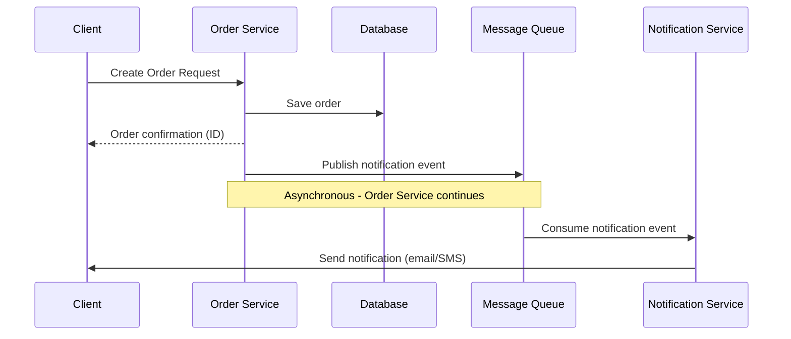
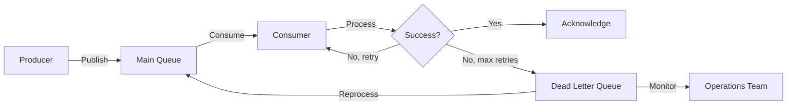
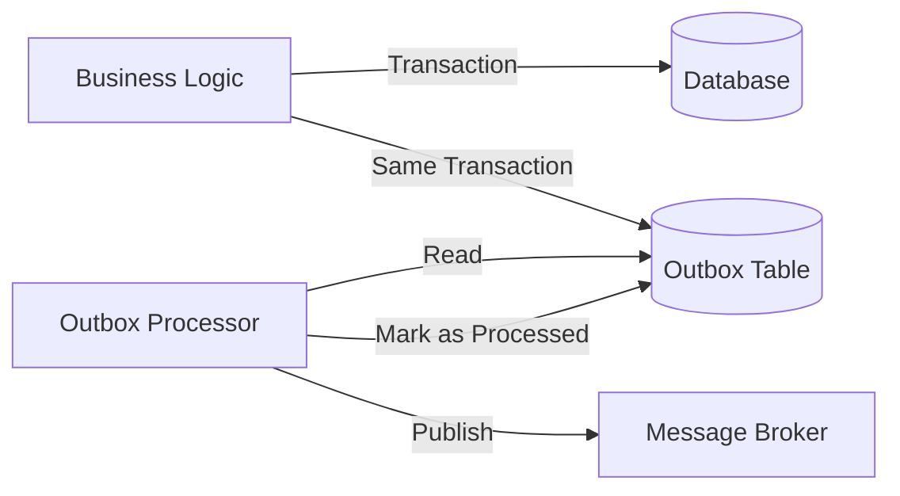

# Overview


Asynchronous messaging is a communication pattern where the sender doesn't wait for the receiver's response before continuing execution. This creates a loosely coupled system where components can operate independently, improving scalability and resilience.

## How it Works

In asynchronous communication:

1. The sender sends a message and continues execution (non-blocking)
2. The message is stored in a queue or message broker
3. The receiver processes the message when available
4. (Optional) The receiver may send an acknowledgment or response via another message

## Example

Let's examine a common asynchronous messaging scenario in an order processing flow:




### Flow

1. **Client Creates Order**: The client sends an order creation request to the order service
2. **Order Persistence**: The order service saves the order in the database
3. **Immediate Response**: The order service returns a confirmation to the client with the order ID
4. **Asynchronous Notification**: The order service publishes a notification event to a message queue (fire & forget)
5. **Independent Processing**: The notification service consumes the event and sends a notification to the customer

### Code Example

```typescript
// Order Service
async function createOrder(orderDetails) {
  try {
    // Save order to database
    const order = await db.orders.create({
      ...orderDetails,
      status: 'CREATED',
      createdAt: new Date()
    });
    
    // Asynchronously publish notification event (fire & forget)
    await messageBroker.publish('order.created', {
      orderId: order.id,
      customerId: order.customerId,
      orderTotal: order.total,
      timestamp: new Date()
    });
    
    // Return immediate response to client
    return { 
      success: true, 
      orderId: order.id,
      message: 'Order created successfully. You will receive a confirmation shortly.'
    };
  } catch (error) {
    console.error('Failed to create order:', error);
    throw new Error(`Order creation failed: ${error.message}`);
  }
}

// Notification Service (separate process/service)
async function processOrderNotifications() {
  // Subscribe to order.created events
  await messageBroker.subscribe('order.created', async (message) => {
    try {
      const { orderId, customerId } = message;
      
      // Get customer details
      const customer = await db.customers.findUnique({
        where: { id: customerId }
      });
      
      // Send notification
      await notificationProvider.send({
        to: customer.email,
        subject: `Order Confirmation #${orderId}`,
        template: 'order-confirmation',
        data: { orderId, customerName: customer.name, ...message }
      });
      
      // Acknowledge successful processing
      await messageBroker.acknowledge(message);
    } catch (error) {
      console.error('Failed to process notification:', error);
      // Message will be retried or sent to DLQ based on broker configuration
    }
  });
}
```


## FAILURES

There are several sections that failure can happen. Let's review them.

1. Subscriber Level
2. Publisher Level

### Subscriber Level

In asynchronous systems, in subscriber level, message processing can fail for various reasons. Dead Letter Queues (DLQs) provide a mechanism to handle these failures gracefully.

#### How DLQs Work

1. When a consumer fails to process a message after a defined number of retries, the message broker moves it to a DLQ
2. The DLQ stores problematic messages for later analysis and potential reprocessing
3. Monitoring systems alert operations teams about messages in DLQs



#### DLQ Implementation

```typescript
// Configure message broker with DLQ
const orderNotificationsQueue = messageBroker.queue('order-notifications', {
  deadLetter: {
    queueName: 'order-notifications-dlq',
    maxRetries: 3,
    retryInterval: 60000 // 1 minute
  }
});

// Monitor DLQ
async function monitorDeadLetterQueue() {
  const dlq = messageBroker.queue('order-notifications-dlq');
  
  // Check DLQ periodically
  setInterval(async () => {
    const messageCount = await dlq.getMessageCount();
    
    if (messageCount > 0) {
      // Alert operations team
      await alertingSystem.sendAlert({
        severity: 'warning',
        message: `${messageCount} messages in order-notifications-dlq`,
        source: 'notification-service'
      });
    }
  }, 300000); // Check every 5 minutes
}

// Reprocess messages from DLQ
async function reprocessDlqMessages() {
  const dlq = messageBroker.queue('order-notifications-dlq');
  const mainQueue = messageBroker.queue('order-notifications');
  
  // Get messages from DLQ
  const failedMessages = await dlq.receiveMessages(10);
  
  for (const message of failedMessages) {
    try {
      // Fix any issues with the message if needed
      const fixedMessage = await fixMessageIssues(message);
      
      // Republish to main queue
      await mainQueue.sendMessage(fixedMessage);
      
      // Remove from DLQ
      await dlq.deleteMessage(message);
      
      console.log(`Successfully reprocessed message ${message.id}`);
    } catch (error) {
      console.error(`Failed to reprocess message ${message.id}:`, error);
    }
  }
}
```

### Publisher Level

One challenge with asynchronous messaging is ensuring that database transactions and message publishing are atomic. **Let's say the broker itself is down or a failure happen just before the message is published.** The Outbox Pattern solves this by storing messages in a database "outbox" table as part of the same transaction. 

#### Outbox Pattern

1. As part of the business transaction, messages are written to an outbox table in the same database
2. A separate process (outbox processor) reads the outbox table and publishes messages to the message broker
3. After successful publishing, the processor marks messages as processed or deletes them



#### Outbox Pattern Implementation

```typescript
// Order Service with Outbox Pattern
async function createOrderWithOutbox(orderDetails) {
  // Start a database transaction
  return await db.$transaction(async (tx) => {
    // 1. Create the order
    const order = await tx.orders.create({
      data: {
        ...orderDetails,
        status: 'CREATED',
        createdAt: new Date()
      }
    });
    
    // 2. Store the outgoing message in the outbox table (same transaction)
    await tx.outbox.create({
      data: {
        eventType: 'order.created',
        payload: JSON.stringify({
          orderId: order.id,
          customerId: order.customerId,
          orderTotal: order.total,
          timestamp: new Date()
        }),
        status: 'PENDING',
        createdAt: new Date()
      }
    });
    
    // Return response to client
    return { 
      success: true, 
      orderId: order.id,
      message: 'Order created successfully. You will receive a confirmation shortly.'
    };
  });
}

// Outbox Processor (runs as a separate process)
async function processOutbox() {
  while (true) {
    try {
      // Get a batch of pending messages
      const pendingMessages = await db.outbox.findMany({
        where: { status: 'PENDING' },
        orderBy: { createdAt: 'asc' },
        take: 10
      });
      
      if (pendingMessages.length === 0) {
        // No messages to process, wait before checking again
        await sleep(1000);
        continue;
      }
      
      for (const message of pendingMessages) {
        try {
          // Publish to message broker
          await messageBroker.publish(
            message.eventType,
            JSON.parse(message.payload)
          );
          
          // Mark as processed
          await db.outbox.update({
            where: { id: message.id },
            data: { 
              status: 'PROCESSED',
              processedAt: new Date()
            }
          });
        } catch (error) {
          console.error(`Failed to process outbox message ${message.id}:`, error);
          
          // Mark as failed if it has been retried too many times
          if (message.retryCount >= 5) {
            await db.outbox.update({
              where: { id: message.id },
              data: { 
                status: 'FAILED',
                error: error.message
              }
            });
          } else {
            // Increment retry count
            await db.outbox.update({
              where: { id: message.id },
              data: { retryCount: { increment: 1 } }
            });
          }
        }
      }
    } catch (error) {
      console.error('Error in outbox processor:', error);
      await sleep(5000); // Wait before retrying
    }
  }
}
```

#### Benefits of the OP

- **Atomicity**: Ensures database changes and message publishing are atomic
- **Reliability**: Messages are never lost, even if the message broker is temporarily unavailable
- **Ordering**: Preserves message order by processing outbox entries in sequence
- **Idempotency**: Can be designed to handle duplicate message publishing
- **Transactional Integrity**: Maintains data consistency across systems

## When to Use

Asynchronous messaging is appropriate when:

- Immediate response is not required
- Operations can be processed in the background
- System components need to be loosely coupled
- You need to improve scalability and resilience
- Operations might take a long time to complete

## Considerations and Tradeoffs

- **Complexity**: Requires additional infrastructure and patterns
- **Eventual Consistency**: Systems may be temporarily out of sync
- **Error Handling**: Requires robust failure handling mechanisms
- **Monitoring**: More challenging to track message flow and diagnose issues
- **Testing**: More difficult to test end-to-end flows

Asynchronous messaging provides significant benefits for system scalability and resilience but requires careful implementation of patterns like DLQ and Outbox to ensure reliability and data consistency.
