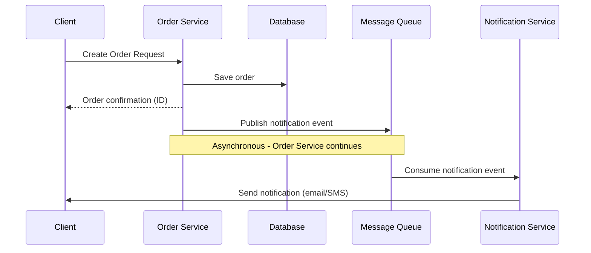
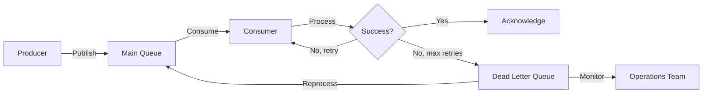
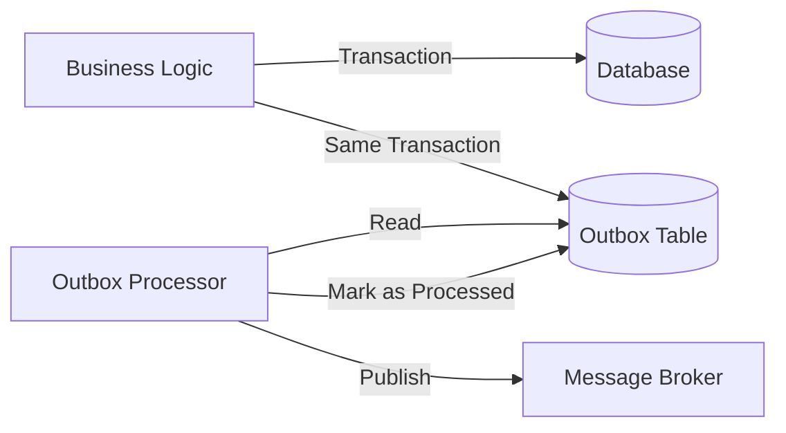
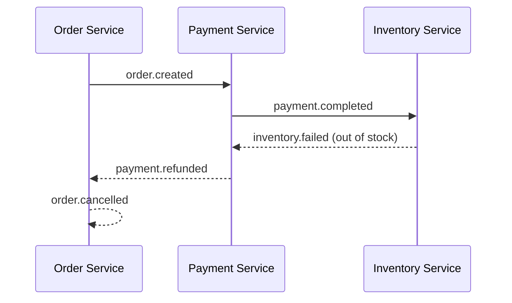
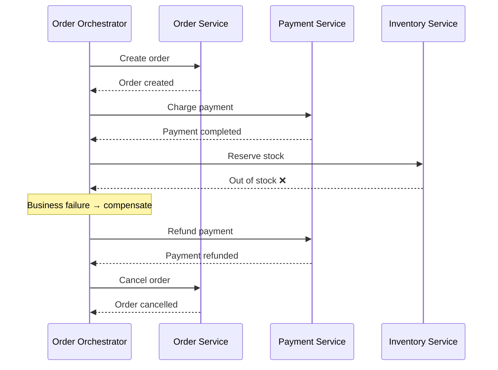

# Overview


Asynchronous messaging is a communication pattern where the sender doesn't wait for the receiver's response before continuing execution. This creates a loosely coupled system where components can operate independently, improving scalability and resilience.

## How it Works

In asynchronous communication:

1. The sender sends a message and continues execution (non-blocking)
2. The message is stored in a queue or message broker
3. The receiver processes the message when available
4. (Optional) The receiver may send an acknowledgment or response via another message

## Example

Let's examine a common asynchronous messaging scenario in an order processing flow:



### Flow

1. **Client Creates Order**: The client sends an order creation request to the order service
2. **Order Persistence**: The order service saves the order in the database
3. **Immediate Response**: The order service returns a confirmation to the client with the order ID
4. **Asynchronous Notification**: The order service publishes a notification event to a message queue (fire & forget)
5. **Independent Processing**: The notification service consumes the event and sends a notification to the customer

### Code Example

```typescript
// Order Service
async function createOrder(orderDetails) {
  try {
    // Save order to database
    const order = await db.orders.create({
      ...orderDetails,
      status: 'CREATED',
      createdAt: new Date(),
    });

    // Asynchronously publish notification event (fire & forget)
    await messageBroker.publish('order.created', {
      orderId: order.id,
      customerId: order.customerId,
      orderTotal: order.total,
      timestamp: new Date(),
    });

    // Return immediate response to client
    return {
      success: true,
      orderId: order.id,
      message:
        'Order created successfully. You will receive a confirmation shortly.',
    };
  } catch (error) {
    console.error('Failed to create order:', error);
    throw new Error(`Order creation failed: ${error.message}`);
  }
}

// Notification Service (separate process/service)
async function processOrderNotifications() {
  // Subscribe to order.created events
  await messageBroker.subscribe('order.created', async (message) => {
    try {
      const { orderId, customerId } = message;

      // Get customer details
      const customer = await db.customers.findUnique({
        where: { id: customerId },
      });

      // Send notification
      await notificationProvider.send({
        to: customer.email,
        subject: `Order Confirmation #${orderId}`,
        template: 'order-confirmation',
        data: { orderId, customerName: customer.name, ...message },
      });

      // Acknowledge successful processing
      await messageBroker.acknowledge(message);
    } catch (error) {
      console.error('Failed to process notification:', error);
      // Message will be retried or sent to DLQ based on broker configuration
    }
  });
}
```

## FAILURES

There are several sections that failure can happen. Let's review them.

1. Subscriber Level
2. Publisher Level
3. Business Domain Level

### Subscriber Level

In asynchronous systems, in subscriber level, message processing can fail for various reasons. Dead Letter Queues (DLQs) provide a mechanism to handle these failures gracefully.

#### How DLQs Work

1. When a consumer fails to process a message after a defined number of retries, the message broker moves it to a DLQ
2. The DLQ stores problematic messages for later analysis and potential reprocessing
3. Monitoring systems alert operations teams about messages in DLQs



#### DLQ Implementation

```typescript
// Configure message broker with DLQ
const orderNotificationsQueue = messageBroker.queue('order-notifications', {
  deadLetter: {
    queueName: 'order-notifications-dlq',
    maxRetries: 3,
    retryInterval: 60000, // 1 minute
  },
});

// Monitor DLQ
async function monitorDeadLetterQueue() {
  const dlq = messageBroker.queue('order-notifications-dlq');

  // Check DLQ periodically
  // setInterval is not ideal for production, but works for demonstration
  setInterval(async () => {
    const messageCount = await dlq.getMessageCount();

    if (messageCount > 0) {
      // Alert operations team
      await alertingSystem.sendAlert({
        severity: 'warning',
        message: `${messageCount} messages in order-notifications-dlq`,
        source: 'notification-service',
      });
    }
  }, 300000); // Check every 5 minutes
}

// Reprocess messages from DLQ
async function reprocessDlqMessages() {
  const dlq = messageBroker.queue('order-notifications-dlq');
  const mainQueue = messageBroker.queue('order-notifications');

  // Get messages from DLQ
  const failedMessages = await dlq.receiveMessages(10);

  for (const message of failedMessages) {
    try {
      // Fix any issues with the message if needed
      const fixedMessage = await fixMessageIssues(message);

      // Republish to main queue
      await mainQueue.sendMessage(fixedMessage);

      // Remove from DLQ
      await dlq.deleteMessage(message);

      console.log(`Successfully reprocessed message ${message.id}`);
    } catch (error) {
      console.error(`Failed to reprocess message ${message.id}:`, error);
    }
  }
}
```

#### Idempotency

Idempotency ensures that processing the same message multiple times produces the same result as processing it once. This is critical in asynchronous systems where messages can be delivered more than once due to network issues, retries, or broker failures.

##### Why Idempotency Matters

In distributed systems, **at-least-once delivery** is often the only guarantee message brokers can provide. This means:

- Messages may be delivered multiple times
- Network failures can cause duplicate sends
- Consumer crashes after processing but before acknowledgment lead to redelivery
- Broker failovers can result in message duplication

Without idempotency, duplicate messages can cause:

- **Double charging** customers in payment systems
- **Duplicate notifications** sent to users
- **Incorrect inventory counts** in stock management
- **Data inconsistencies** across services

**Implement Idempotency**

Track processed messages using unique identifiers:

```typescript
// Message consumer with idempotency key tracking
async function processOrderNotification(message) {
  const idempotencyKey = message.messageId; // or message.orderId

  // Start transaction
  return await db.$transaction(async (tx) => {
    // Check if we've already processed this message
    const existing = await tx.processedMessages.findUnique({
      where: { messageId: idempotencyKey },
    });

    if (existing) {
      console.log(`Message ${idempotencyKey} already processed, skipping`);
      return { status: 'duplicate', result: existing.result };
    }

    // Process the message
    const customer = await tx.customers.findUnique({
      where: { id: message.customerId },
    });

    await notificationProvider.send({
      to: customer.email,
      subject: `Order Confirmation #${message.orderId}`,
      template: 'order-confirmation',
      data: message,
    });

    // Record that we've processed this message
    await tx.processedMessages.create({
      data: {
        messageId: idempotencyKey,
        processedAt: new Date(),
        result: JSON.stringify({ sent: true, orderId: message.orderId }),
      },
    });

    return { status: 'processed', orderId: message.orderId };
  });
}
```

**3. Database Schema for Idempotency**

```sql
-- Table to track processed messages
CREATE TABLE processed_messages (
  message_id VARCHAR(255) PRIMARY KEY,
  processed_at TIMESTAMP NOT NULL DEFAULT CURRENT_TIMESTAMP,
  result JSONB,
  expires_at TIMESTAMP,
  INDEX idx_expires_at (expires_at)
);

-- Cleanup job to remove old entries (run periodically)
DELETE FROM processed_messages
WHERE expires_at < NOW();
```

**4. Composite Idempotency Keys**

For complex scenarios, use composite keys:

```typescript
async function processInventoryUpdate(message) {
  // Composite key: productId + version ensures idempotency per product version
  const idempotencyKey = `${message.productId}-${message.version}`;

  const existing = await db.processedMessages.findUnique({
    where: { messageId: idempotencyKey },
  });

  if (existing) {
    return { status: 'duplicate' };
  }

  // Update inventory only if version matches (optimistic locking)
  const updated = await db.products.updateMany({
    where: {
      id: message.productId,
      version: message.version - 1, // Ensure we're updating the right version
    },
    data: {
      stock: message.newStock,
      version: message.version,
    },
  });

  if (updated.count === 0) {
    throw new Error('Version mismatch - product already updated');
  }

  // Record processing
  await db.processedMessages.create({
    data: {
      messageId: idempotencyKey,
      processedAt: new Date(),
      expiresAt: new Date(Date.now() + 7 * 24 * 60 * 60 * 1000), // 7 days
    },
  });

  return { status: 'processed' };
}
```

#### DLQ Monitoring and Management

The DLQ monitoring and management system ensures that failed messages are properly tracked and can be reprocessed when issues are resolved. As mentioned in the comments, `setInterval` is not ideal for production, but works for demonstration.

### Publisher Level

One challenge with asynchronous messaging is ensuring that database transactions and message publishing are atomic. **Let's say the broker itself is down or a failure happen just before the message is published.** The Outbox Pattern solves this by storing messages in a database "outbox" table as part of the same transaction.

#### Outbox Pattern

1. As part of the business transaction, messages are written to an outbox table in the same database
2. A separate process (outbox processor) reads the outbox table and publishes messages to the message broker
3. After successful publishing, the processor marks messages as processed or deletes them



#### Outbox Pattern Implementation

```typescript
// Order Service with Outbox Pattern
async function createOrderWithOutbox(orderDetails) {
  // Start a database transaction
  return await db.$transaction(async (tx) => {
    // 1. Create the order
    const order = await tx.orders.create({
      data: {
        ...orderDetails,
        status: 'CREATED',
        createdAt: new Date(),
      },
    });

    // 2. Store the outgoing message in the outbox table (same transaction)
    await tx.outbox.create({
      data: {
        eventType: 'order.created',
        payload: JSON.stringify({
          orderId: order.id,
          customerId: order.customerId,
          orderTotal: order.total,
          timestamp: new Date(),
        }),
        status: 'PENDING',
        createdAt: new Date(),
      },
    });

    // Return response to client
    return {
      success: true,
      orderId: order.id,
      message:
        'Order created successfully. You will receive a confirmation shortly.',
    };
  });
}

// Outbox Processor (runs as a separate process)
async function processOutbox() {
  while (true) {
    try {
      // Get a batch of pending messages
      const pendingMessages = await db.outbox.findMany({
        where: { status: 'PENDING' },
        orderBy: { createdAt: 'asc' },
        take: 10,
      });

      if (pendingMessages.length === 0) {
        // No messages to process, wait before checking again
        await sleep(1000);
        continue;
      }

      for (const message of pendingMessages) {
        try {
          // Publish to message broker
          await messageBroker.publish(
            message.eventType,
            JSON.parse(message.payload),
          );

          // Mark as processed
          await db.outbox.update({
            where: { id: message.id },
            data: {
              status: 'PROCESSED',
              processedAt: new Date(),
            },
          });
        } catch (error) {
          console.error(
            `Failed to process outbox message ${message.id}:`,
            error,
          );

          // Mark as failed if it has been retried too many times
          if (message.retryCount >= 5) {
            await db.outbox.update({
              where: { id: message.id },
              data: {
                status: 'FAILED',
                error: error.message,
              },
            });
          } else {
            // Increment retry count
            await db.outbox.update({
              where: { id: message.id },
              data: { retryCount: { increment: 1 } },
            });
          }
        }
      }
    } catch (error) {
      console.error('Error in outbox processor:', error);
      await sleep(5000); // Wait before retrying
    }
  }
}
```

#### Benefits of the OP

- **Atomicity**: Ensures database changes and message publishing are atomic
- **Reliability**: Messages are never lost, even if the message broker is temporarily unavailable
- **Ordering**: Preserves message order by processing outbox entries in sequence
- **Idempotency**: Can be designed to handle duplicate message publishing
- **Transactional Integrity**: Maintains data consistency across systems

### Business Domain Level

The previous failure types were **technical** — a subscriber crashes, a broker goes down, a transaction fails to commit. But what happens when every service processes its message successfully, yet the **business outcome is invalid**?

For example, consider an e-commerce order flow:

1. **Order Service** creates the order ✅
2. **Payment Service** charges the customer ✅
3. **Inventory Service** tries to reserve items — but the product is **out of stock** ❌

There is no technical failure here. Every service received and processed its message correctly. The problem is that the business operation as a whole cannot be completed. The payment needs to be refunded and the order needs to be cancelled.

In a monolithic system, you would wrap this in a single database transaction and roll back. In a distributed system with asynchronous messaging, there is no shared transaction. Each service has its own database. This is where the **Saga pattern** comes in.

#### Saga Pattern

A saga is a sequence of local transactions across multiple services. If one step fails due to a business rule violation, the saga executes **compensating transactions** to undo the changes made by previous steps.

There are two common approaches to implementing sagas:

#### Choreography-Based Saga

Each service listens for events and decides what to do next. There is no central coordinator — services react to each other's events.



##### How It Works

1. **Order Service** creates an order and publishes `order.created`
2. **Payment Service** receives the event, charges the customer, and publishes `payment.completed`
3. **Inventory Service** receives the event, tries to reserve stock, but the item is out of stock — publishes `inventory.failed`
4. **Payment Service** listens for `inventory.failed`, refunds the customer, and publishes `payment.refunded`
5. **Order Service** listens for `payment.refunded` and marks the order as cancelled

Each service only knows about the events it cares about. There is no single place that defines the overall flow.

##### Implementation

```typescript
// Order Service
await messageBroker.subscribe('payment.refunded', async (message) => {
  await db.orders.update({
    where: { id: message.orderId },
    data: { status: 'CANCELLED', reason: message.reason },
  });
  await messageBroker.acknowledge(message);
});

// Payment Service
await messageBroker.subscribe('order.created', async (message) => {
  const payment = await paymentProvider.charge({
    customerId: message.customerId,
    amount: message.orderTotal,
  });

  await messageBroker.publish('payment.completed', {
    orderId: message.orderId,
    paymentId: payment.id,
    customerId: message.customerId,
  });
  await messageBroker.acknowledge(message);
});

await messageBroker.subscribe('inventory.failed', async (message) => {
  // Compensating transaction: refund the payment
  await paymentProvider.refund({ paymentId: message.paymentId });

  await messageBroker.publish('payment.refunded', {
    orderId: message.orderId,
    reason: message.reason,
  });
  await messageBroker.acknowledge(message);
});

// Inventory Service
await messageBroker.subscribe('payment.completed', async (message) => {
  const reserved = await db.products.updateMany({
    where: { id: message.productId, stock: { gt: 0 } },
    data: { stock: { decrement: 1 } },
  });

  if (reserved.count === 0) {
    // Business failure: out of stock
    await messageBroker.publish('inventory.failed', {
      orderId: message.orderId,
      paymentId: message.paymentId,
      reason: 'Product out of stock',
    });
  } else {
    await messageBroker.publish('inventory.reserved', {
      orderId: message.orderId,
    });
  }
  await messageBroker.acknowledge(message);
});
```

**Tradeoffs of Choreography:**

- ✅ Simple to implement for small flows
- ✅ Services are loosely coupled
- ❌ Hard to understand the overall flow — logic is spread across services
- ❌ Difficult to add new steps or change the order
- ❌ Risk of cyclic dependencies between services

#### Orchestration-Based Saga

A central **orchestrator** service controls the saga. It tells each service what to do and handles failures by invoking compensating transactions.



##### Implementation

```typescript
// Order Saga Orchestrator
async function executeOrderSaga(orderDetails) {
  const sagaLog = await db.sagaLog.create({
    data: {
      type: 'CREATE_ORDER',
      status: 'STARTED',
      payload: JSON.stringify(orderDetails),
    },
  });

  const completedSteps = [];

  try {
    // Step 1: Create order
    const order = await orderService.create(orderDetails);
    completedSteps.push({ step: 'ORDER_CREATED', data: order });

    // Step 2: Charge payment
    const payment = await paymentService.charge({
      customerId: order.customerId,
      amount: order.total,
    });
    completedSteps.push({ step: 'PAYMENT_CHARGED', data: payment });

    // Step 3: Reserve inventory
    await inventoryService.reserve({
      productId: order.productId,
      quantity: order.quantity,
    });
    completedSteps.push({ step: 'INVENTORY_RESERVED' });

    // All steps succeeded
    await db.sagaLog.update({
      where: { id: sagaLog.id },
      data: { status: 'COMPLETED' },
    });

    return { success: true, orderId: order.id };
  } catch (error) {
    // Business failure — run compensating transactions in reverse order
    await db.sagaLog.update({
      where: { id: sagaLog.id },
      data: { status: 'COMPENSATING', error: error.message },
    });

    await compensate(completedSteps);

    await db.sagaLog.update({
      where: { id: sagaLog.id },
      data: { status: 'COMPENSATED' },
    });

    return { success: false, reason: error.message };
  }
}

// Compensating transactions — undo steps in reverse
async function compensate(completedSteps) {
  for (const step of [...completedSteps].reverse()) {
    switch (step.step) {
      case 'INVENTORY_RESERVED':
        await inventoryService.release({
          productId: step.data.productId,
          quantity: step.data.quantity,
        });
        break;
      case 'PAYMENT_CHARGED':
        await paymentService.refund({ paymentId: step.data.id });
        break;
      case 'ORDER_CREATED':
        await orderService.cancel({
          orderId: step.data.id,
          reason: 'Saga compensation',
        });
        break;
    }
  }
}
```

**Tradeoffs of Orchestration:**

- ✅ Easy to understand — the entire flow is in one place
- ✅ Easy to add new steps or modify the sequence
- ✅ Simpler error handling and compensation logic
- ❌ The orchestrator is a single point of coupling
- ❌ The orchestrator service can become complex for large flows

#### Choosing Between Choreography and Orchestration

| Aspect | Choreography | Orchestration |
| --- | --- | --- |
| **Coupling** | Low — services only know about events | Higher — orchestrator knows all services |
| **Visibility** | Flow is implicit, spread across services | Flow is explicit, in one place |
| **Complexity** | Grows quickly with more services | Grows linearly |
| **Best for** | Simple flows with few steps | Complex flows with many steps or conditions |

For most real-world systems with non-trivial business flows, **orchestration** tends to be the more maintainable choice.

## When to Use

Asynchronous messaging is appropriate when:

- Immediate response is not required
- Operations can be processed in the background
- System components need to be loosely coupled
- You need to improve scalability and resilience
- Operations might take a long time to complete

## Considerations and Tradeoffs

- **Complexity**: Requires additional infrastructure and patterns
- **Eventual Consistency**: Systems may be temporarily out of sync
- **Error Handling**: Requires robust failure handling mechanisms
- **Monitoring**: More challenging to track message flow and diagnose issues
- **Testing**: More difficult to test end-to-end flows

Asynchronous messaging provides significant benefits for system scalability and resilience but requires careful implementation of patterns like DLQ and Outbox to ensure reliability and data consistency.
