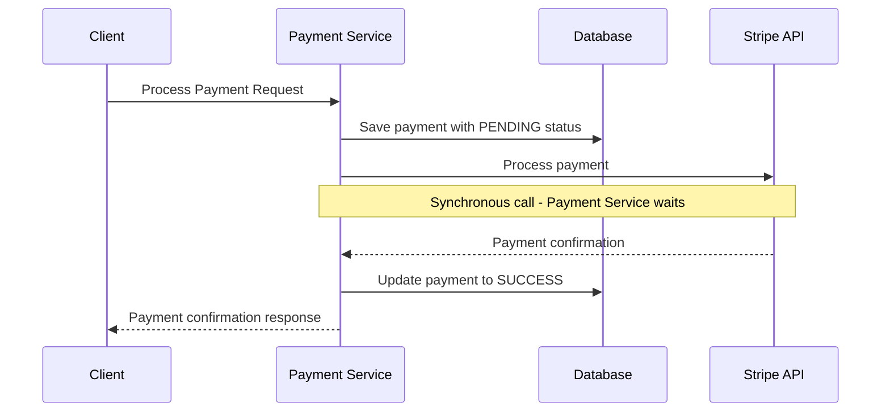
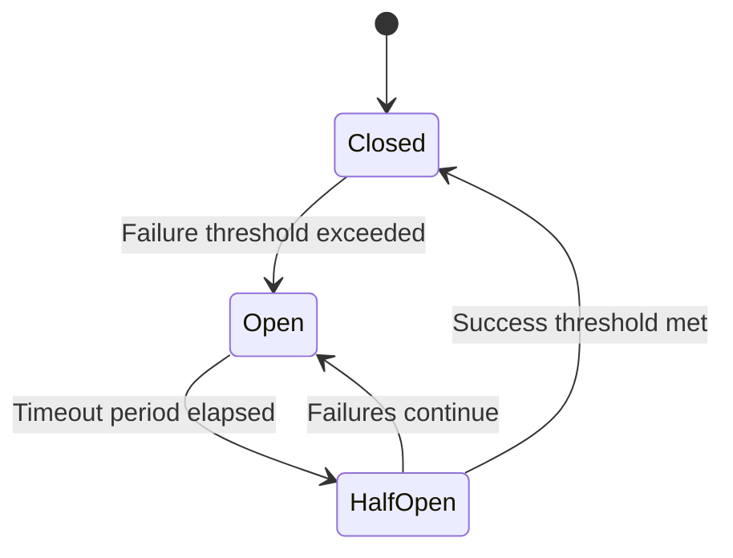

# Synchronous Messaging


Synchronous messaging is a communication pattern where the sender waits for the receiver's response before continuing execution. This creates a direct, real-time interaction between services but introduces tight coupling and potential performance bottlenecks.

## How it Works

In synchronous communication:

1. The sender initiates a request and then waits (blocks)
2. The receiver processes the request
3. The receiver sends back a response
4. The sender continues execution after receiving the response

## Real-World Example

Let's examine a common synchronous messaging scenario in a payment processing flow:



### Implementation Flow

1. **Client Initiates Payment**: The client sends a payment request to the payment service
2. **Initial Persistence**: The payment service saves the payment in the database with a "PENDING" status
3. **Synchronous External Call**: The payment service makes a synchronous HTTP request to the Stripe API
4. **Waiting Period**: The payment service waits for Stripe's response (blocking)
5. **Response Handling**: Upon receiving confirmation from Stripe, the payment service updates the payment status to "SUCCESS"
6. **Client Notification**: The payment service returns the confirmation to the client

### Code Example

```typescript
async function processPayment(paymentDetails) {
  try {
    // Save payment with PENDING status
    const payment = await db.payments.create({
      ...paymentDetails,
      status: 'PENDING',
      createdAt: new Date()
    });
    
    // Make synchronous call to Stripe
    const stripeResponse = await stripeClient.charges.create({
      amount: paymentDetails.amount,
      currency: paymentDetails.currency,
      source: paymentDetails.token,
      description: paymentDetails.description
    });
    
    // Update payment status based on response
    await db.payments.update({
      where: { id: payment.id },
      data: { 
        status: 'SUCCESS',
        transactionId: stripeResponse.id,
        updatedAt: new Date()
      }
    });
    
    return { success: true, paymentId: payment.id };
  } catch (error) {
    // Handle failure
    await db.payments.update({
      where: { id: payment.id },
      data: { 
        status: 'FAILED',
        errorMessage: error.message,
        updatedAt: new Date()
      }
    });
    
    throw new Error(`Payment processing failed: ${error.message}`);
  }
}
```

## FAILURES

Synchronous calls to external services can fail due to network issues, service unavailability, or timeouts. The Circuit Breaker pattern helps prevent cascading failures and provides resilience.

### Circuit Breaker

1. **Closed State**: Normal operation, requests pass through
2. **Open State**: Failure threshold exceeded, requests fail fast without calling the service
3. **Half-Open State**: After a timeout period, allows limited requests to test if the service has recovered



### Implementation Example

```typescript
import { CircuitBreaker } from 'opossum'; // Popular circuit breaker library

// Configure the circuit breaker
const stripeCircuitBreaker = new CircuitBreaker(stripeClient.charges.create, {
  failureThreshold: 3,           // Number of failures before opening circuit
  resetTimeout: 30000,           // Time in ms to wait before testing service again
  timeout: 5000,                 // Request timeout
  errorThresholdPercentage: 50   // Error percentage to trip circuit
});

// Add listeners for circuit state changes
stripeCircuitBreaker.on('open', () => {
  console.log('Circuit breaker opened - Stripe service appears to be down');
  // Alert operations team
});

stripeCircuitBreaker.on('halfOpen', () => {
  console.log('Circuit breaker half-open - Testing Stripe service availability');
});

stripeCircuitBreaker.on('close', () => {
  console.log('Circuit breaker closed - Stripe service has recovered');
});

async function processPaymentWithCircuitBreaker(paymentDetails) {
  try {
    // Save payment with PENDING status
    const payment = await db.payments.create({
      ...paymentDetails,
      status: 'PENDING',
      createdAt: new Date()
    });
    
    // Make synchronous call to Stripe with circuit breaker
    const stripeResponse = await stripeCircuitBreaker.fire({
      amount: paymentDetails.amount,
      currency: paymentDetails.currency,
      source: paymentDetails.token,
      description: paymentDetails.description
    });
    
    // Update payment status based on response
    await db.payments.update({
      where: { id: payment.id },
      data: { 
        status: 'SUCCESS',
        transactionId: stripeResponse.id,
        updatedAt: new Date()
      }
    });
    
    return { success: true, paymentId: payment.id };
  } catch (error) {
    // Handle failure - could be circuit open or actual error
    await db.payments.update({
      where: { id: payment.id },
      data: { 
        status: 'FAILED',
        errorMessage: error.message,
        updatedAt: new Date()
      }
    });
    
    // Implement fallback strategy
    if (stripeCircuitBreaker.status === 'open') {
      // Queue for retry later or use backup payment processor
      await paymentRetryQueue.add(paymentDetails);
      return { success: false, status: 'QUEUED_FOR_RETRY' };
    }
    
    throw new Error(`Payment processing failed: ${error.message}`);
  }
}
```

## Benefits of CB Pattern

- **Fail Fast**: Prevents requests to failing services, reducing latency
- **Resource Protection**: Avoids thread pool exhaustion from hanging requests
- **Self-Healing**: Automatically tests service recovery
- **Graceful Degradation**: Enables fallback mechanisms when services are down
- **Monitoring**: Provides insights into service health

## When to Use

Synchronous messaging is appropriate when:

- Immediate confirmation is required
- The operation is critical for the user flow to continue
- Strong consistency is needed between systems
- The response time of the external service is reliable and fast
- The client needs to make decisions based on the response

## Considerations and Tradeoffs

- **Latency**: Each synchronous call adds to the overall response time
- **Availability**: System availability becomes dependent on all services in the chain
- **Scalability**: Holding connections open limits scalability
- **Resource Usage**: Blocked threads consume resources while waiting
- **Complexity**: Proper error handling and resilience patterns add complexity

Synchronous messaging provides immediate consistency but requires careful implementation of resilience patterns like circuit breakers to prevent cascading failures in distributed systems.
