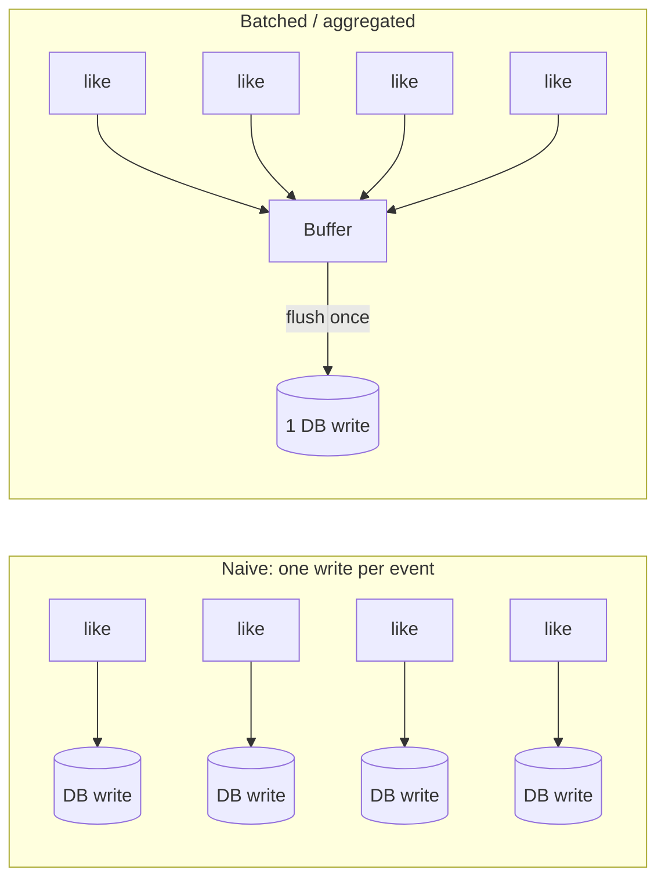
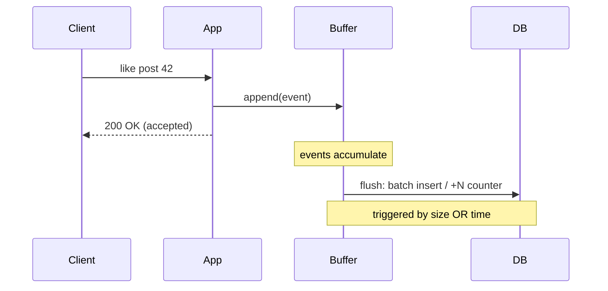
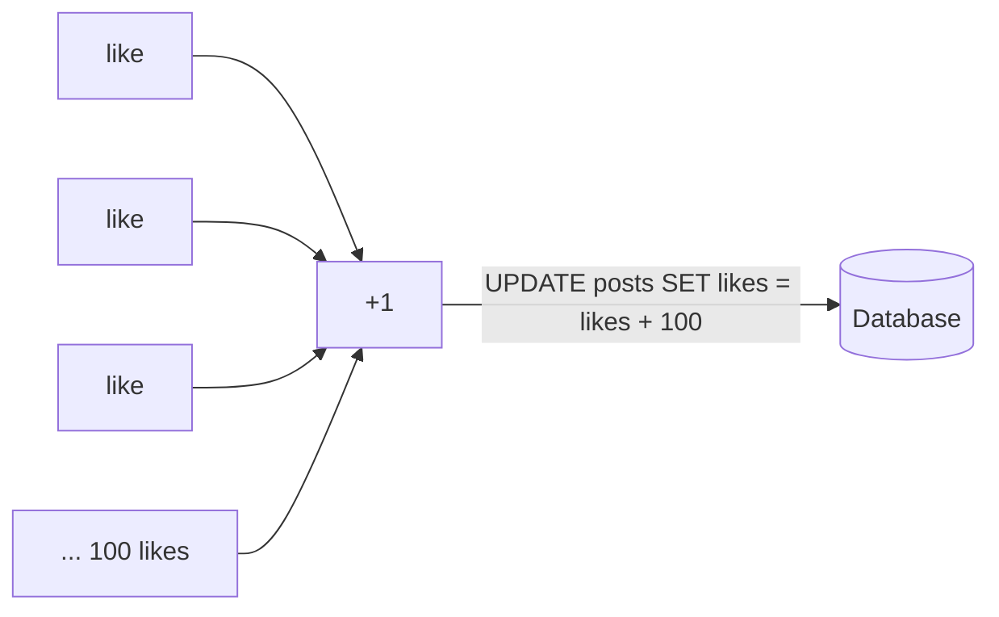
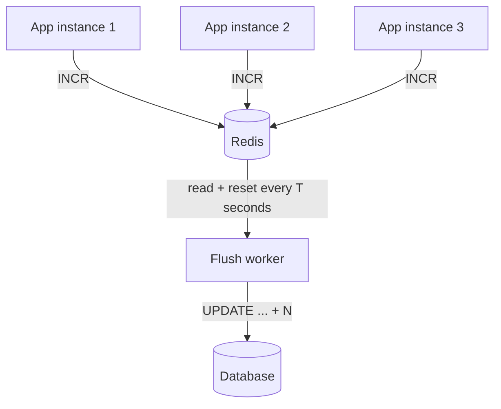
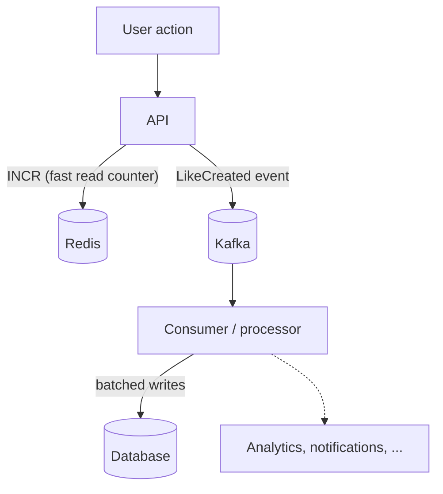

Some events arrive in enormous volume but each one is individually cheap and not urgent: a like on a post, a video view, a page-view counter, an analytics event. The naive implementation does **one database write per event** — one `INSERT` per like, one `UPDATE ... SET count = count + 1` per view. That works fine in development and collapses in production.

The problem is that the cost of a write is dominated by *fixed overhead* — a network round trip, a transaction, index maintenance, a row lock — not by the size of the data. Paying that overhead once per event, thousands of times per second, is what melts the database. When a popular post gets 100,000 likes in a minute, that's 100,000 round trips and 100,000 row locks on the same counter.

> This is the idea behind the "Instagram doesn't `INSERT` on every like" observation: instead of one write per like, the system **buffers** likes and periodically applies them together — for example, one batched insert (or one aggregated `+N` to a counter) for every ~100 likes instead of 100 separate writes.

Two related techniques solve this, and they're usually combined:

- **Batching** — group N individual operations into a single round trip (one multi-row `INSERT` instead of N single-row inserts). Same number of rows, far less overhead.
- **Aggregation** — collapse many events into a *summary* before writing at all (turn 100 likes into a single `+100`). Fewer rows, and contention on the hot counter drops from 100 conflicting updates to one.



## The core mechanism: buffer, then flush

Every batching implementation is the same shape: writes go into a **buffer** instead of straight to the database, and a **flush** drains the buffer to the database as one operation. The only interesting decisions are *where the buffer lives* and *what triggers a flush*.



Note the key trade-off already visible here: the client gets a `200 OK` **before** the write reaches the database. The event is *accepted*, not yet *durable*. That's the price of batching, and it's why this recipe fits likes and view counts but not payments.

### Flush triggers

A buffer must flush on **whichever of two conditions comes first** — never just one:

- **Size threshold** — flush once the buffer holds N events (e.g. 100). Keeps batches efficient under high load.
- **Time threshold** — flush every T milliseconds regardless of size (e.g. every 1s). Guarantees a low-traffic buffer doesn't hold events forever.

Using size alone means a post with 3 likes never gets written until 97 more arrive. Using time alone means a viral spike builds a giant buffer between ticks. You need both.

| Trigger | Flushes when | Protects against |
| ------- | ------------ | ---------------- |
| Size (count) | Buffer reaches N events | Huge buffers / memory blowup under load |
| Time (interval) | T ms elapsed since last flush | Events stuck forever in a quiet buffer |
| Size **or** time | Whichever comes first | Both — this is what you actually ship |

## Batching: many rows, one insert

When you need to keep each event as its own row (for example, *who* liked *what*, so you can render "liked by Alice and 3 others"), batch the inserts. The rows are identical to the per-event version; you just send them together.

```typescript
type LikeEvent = { userId: string; postId: string; createdAt: number };

class LikeBatcher {
  private buffer: LikeEvent[] = [];
  private timer: NodeJS.Timeout | null = null;

  private readonly maxSize = 100; // flush after 100 events…
  private readonly maxDelayMs = 1000; // …or after 1 second, whichever first

  add(event: LikeEvent): void {
    this.buffer.push(event);

    if (this.buffer.length >= this.maxSize) {
      void this.flush(); // size trigger
    } else if (this.timer === null) {
      this.timer = setTimeout(() => void this.flush(), this.maxDelayMs); // time trigger
    }
  }

  async flush(): Promise<void> {
    if (this.timer !== null) {
      clearTimeout(this.timer);
      this.timer = null;
    }
    if (this.buffer.length === 0) return;

    const batch = this.buffer;
    this.buffer = []; // swap out immediately so new events land in a fresh buffer

    // One multi-row INSERT instead of `batch.length` separate inserts.
    const values = batch.map((e) => [e.userId, e.postId, e.createdAt]);
    await db.query(
      `INSERT INTO likes (user_id, post_id, created_at) VALUES ${placeholders(values)}
       ON CONFLICT (user_id, post_id) DO NOTHING`, // idempotent: double-likes are harmless
      values.flat(),
    );
  }
}
```

Two details that matter in practice:

- **Swap the buffer before the `await`.** Reassign `this.buffer = []` *before* the async insert so events arriving mid-flush go into a clean buffer and aren't lost or double-written.
- **Make the write idempotent.** A retry after a partial failure shouldn't create duplicate likes. `ON CONFLICT DO NOTHING` (or an upsert) means re-flushing the same batch is safe.

## Aggregation: many events, one number

If you only care about the *total* — a like **count**, a view **count** — you don't need a row per event at all. Collapse the events into a single delta and apply it once. This is strictly better than batched inserts for counters because it also removes lock contention on the hot row.



```typescript
class LikeCounterAggregator {
  private pending = new Map<string, number>(); // postId -> delta

  add(postId: string): void {
    this.pending.set(postId, (this.pending.get(postId) ?? 0) + 1);
  }

  async flush(): Promise<void> {
    if (this.pending.size === 0) return;

    const deltas = [...this.pending.entries()];
    this.pending = new Map();

    // One UPDATE per post, each carrying the whole accumulated delta.
    await Promise.all(
      deltas.map(([postId, delta]) =>
        db.query('UPDATE posts SET like_count = like_count + $1 WHERE id = $2', [delta, postId]),
      ),
    );
  }
}
```

100 likes on the same post become **one** `+100` update instead of 100 competing `+1` updates. The database does a fraction of the work, and the hot row is locked once per flush instead of once per like.

## Where should the buffer live?

The code above buffers **in the application process's memory**. That's the simplest option, but it has a sharp edge: if the process crashes before a flush, the buffered events are gone. It also doesn't aggregate across instances — behind a [load balancer](/docs/load-balancing), 10 app instances each keep their own partial buffer.

Using a [distributed cache](/docs/caching/distributed-caching) like **Redis** as the buffer fixes both problems. Redis `INCR` is atomic, so every instance increments the same shared counter, and a background worker periodically drains the accumulated totals to the database.



```typescript
// Write path — every instance shares one counter, no per-instance buffer.
async function like(postId: string): Promise<void> {
  await redis
    .multi() // both commands run atomically
    .incr(`likes:pending:${postId}`) // bump this post's pending delta
    .sadd('likes:dirty', postId) // remember which posts need flushing
    .exec();
}

// Flush worker — runs on an interval, drains Redis into the DB.
async function flushPendingLikes(): Promise<void> {
  // Drain the *set of dirty ids*, never `KEYS`/`SCAN` over the whole keyspace —
  // `KEYS` is O(N) and blocks the single-threaded Redis server in production.
  const postIds = await redis.spop('likes:dirty', 500); // pop up to 500 ids at a time
  for (const postId of postIds) {
    // GETDEL reads and clears atomically so concurrent likes aren't lost.
    const delta = Number(await redis.getdel(`likes:pending:${postId}`));
    if (delta > 0) {
      await db.query('UPDATE posts SET like_count = like_count + $1 WHERE id = $2', [delta, postId]);
    }
  }
}
```

This is really the [write-behind (write-back) caching pattern](/docs/caching/caching-patterns) applied to counters: writes hit the fast store immediately and are asynchronously flushed to the source of truth. Reads can serve `db_count + redis_pending` if you need the number to look live before the next flush.

| Buffer location | Survives crash? | Shared across fleet? | Complexity |
| --------------- | --------------- | -------------------- | ---------- |
| In-process memory | No — lost on crash | No — one buffer per instance | Lowest |
| Redis (shared) | Mostly — survives app crash | Yes — one logical counter | Medium |
| Durable queue / log (Kafka) | Yes — replayable | Yes | Highest |

For the strongest durability, push each event onto a durable log with [asynchronous messaging](/docs/messaging/asynchronous-messaging) and let a consumer batch them into the database — nothing is lost even if every app instance dies, at the cost of running a broker.

### Redis pipelining

If you're flushing many Redis commands at once (say, resetting hundreds of counters), **pipelining** sends them in one network round trip instead of paying latency per command. It's the batching idea applied to the Redis protocol itself. Note it only saves round trips — it is **not** a transaction and does **not** make the commands atomic.

```typescript
const pipe = redis.pipeline();
for (const key of keys) pipe.getdel(key); // queued, not sent yet
const results = await pipe.exec(); // one round trip for all of them
```

## Redis + Kafka: fast counter, durable stream

At high scale the two jobs are usually split across **two** systems, because Redis and a log like **Kafka** solve genuinely different problems:

- **Redis** holds the *current state* — `post:123:likes = 500000` — as a cheap atomic in-memory `INCR`, so reads are instant and the DB never sees the firehose.
- **Kafka** holds the *event history* — `LikeCreated { postId, userId }` — durably and replayably, so consumers can update the DB, analytics, and notifications asynchronously, and recover by replaying if one fails.
- **The database** stays the *permanent source of truth*, written in batches by a consumer.

Redis alone can't replace this: it stores the number, not *who liked what or when*, and a crash can lose data with no way to replay.



### Kafka consumer batching

Kafka consumers are **pull-based** — they poll the broker, which already hands back messages in **batches** (the batch size is governed by fetch settings like `maxBytesPerPartition` / `minBytes`, not by hand-rolling an accumulator). You process the whole batch, then advance the offset. Here's the real KafkaJS `eachBatch` shape:

```typescript
await consumer.run({
  eachBatch: async ({ batch, resolveOffset, commitOffsetsIfNecessary, heartbeat }) => {
    const rows = batch.messages.map((m) => JSON.parse(m.value!.toString()) as LikeEvent);

    await batchInsertLikes(rows); // 1. write the whole batch to the DB first…

    for (const m of batch.messages) resolveOffset(m.offset); // 2. mark them processed
    await commitOffsetsIfNecessary(); // 3. …commit ONLY after the DB write succeeded
    await heartbeat(); // keep the session alive on long batches
  },
});
```

The critical rule: **commit Kafka offsets only after the DB write succeeds.** If the consumer crashes before committing, Kafka redelivers those messages from the last committed offset — you never lose an event. That guarantee is **at-least-once** delivery, which means a message can be delivered twice, so the DB write must be **idempotent** (unique constraints / upserts / dedup keys) for replays to be harmless.

| System | Role | What it's good at |
| ------ | ---- | ----------------- |
| Redis | Fast current state / counters | Cheap atomic `INCR`, instant reads |
| Kafka | Durable event history + async processing | Replay, fan-out to many consumers |
| Database | Permanent source of truth | Durable, queryable, batched writes |

## The trade-offs you're accepting

Batching is not free. Reach for it only when every one of these is acceptable:

- **Delayed durability** — an accepted event can be lost if the buffer dies before flushing. Fine for a like; unacceptable for a payment or an order.
- **Delayed visibility** — the persisted count lags real time by up to one flush interval. Usually hidden by optimistic UI (the client shows the like immediately) and/or by reading `stored + pending`.
- **Approximate ordering** — events within a batch lose their fine-grained order. Fine for counters; think twice if exact sequence matters.
- **Idempotency is mandatory** — flushes will occasionally be retried. Every batched write must be safe to apply twice (`ON CONFLICT`, upserts, or dedup keys).

The rule of thumb mirrors the one from caching: batch the writes that are **high-frequency, low-value, and tolerant of a little delay**. Likes, views, reactions, telemetry, and metrics fit perfectly. Anything a user would be upset to lose — money, orders, messages — should be written durably first and batched only *after* it's safe.

## When to use it

| Workload | Batch / aggregate? | Why |
| -------- | ------------------ | --- |
| Likes, reactions, claps | ✅ | High volume, loss-tolerant, count is what matters |
| View / play counts | ✅ | Extremely high volume, approximate is fine |
| Analytics / telemetry events | ✅ | Firehose volume, designed to be aggregated |
| Audit log of security events | ⚠️ | Batch the *transport*, but never drop on crash — use a durable log |
| Payments, orders, inventory | ❌ | Must be durable and exact the moment they're accepted |

## Related

- **[Caching Patterns](/docs/caching/caching-patterns)** — write-behind is the same buffer-then-flush idea generalized to any cached write.
- **[Distributed Caching](/docs/caching/distributed-caching)** — using Redis as a shared, fleet-wide buffer.
- **[Asynchronous Messaging](/docs/messaging/asynchronous-messaging)** — a durable queue as the buffer when losing events is not an option.
